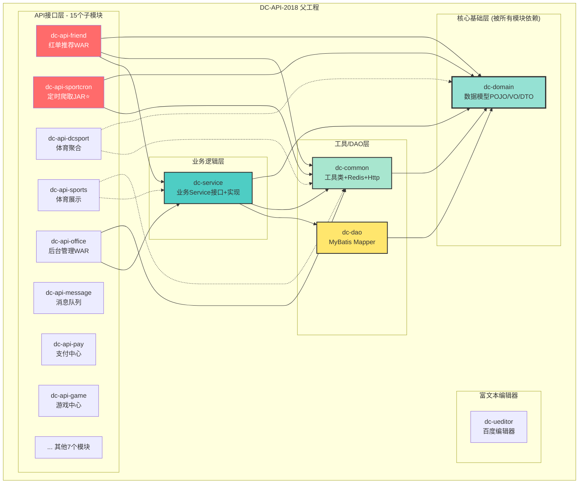
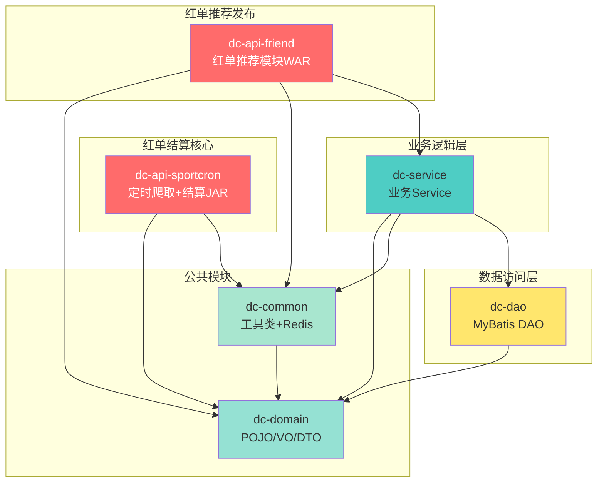
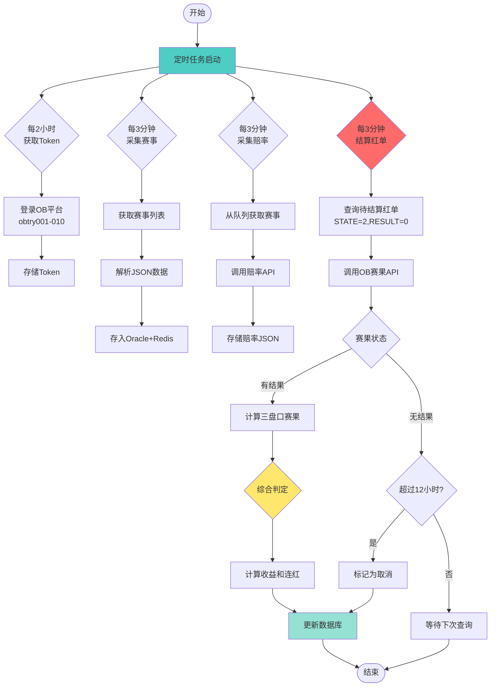
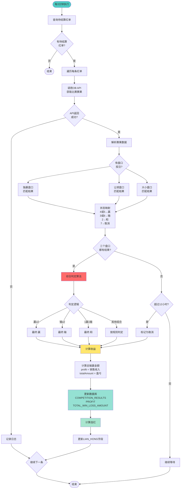
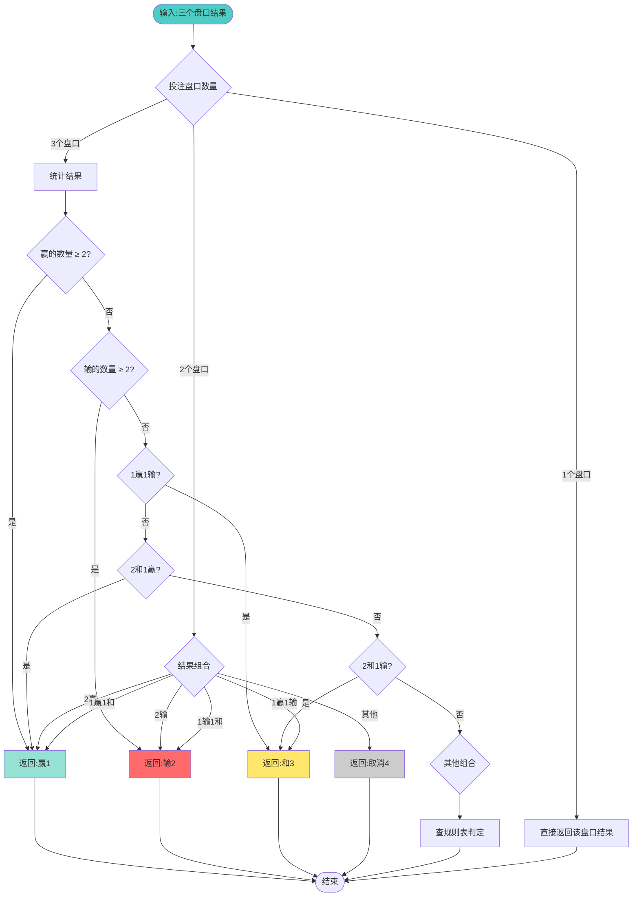
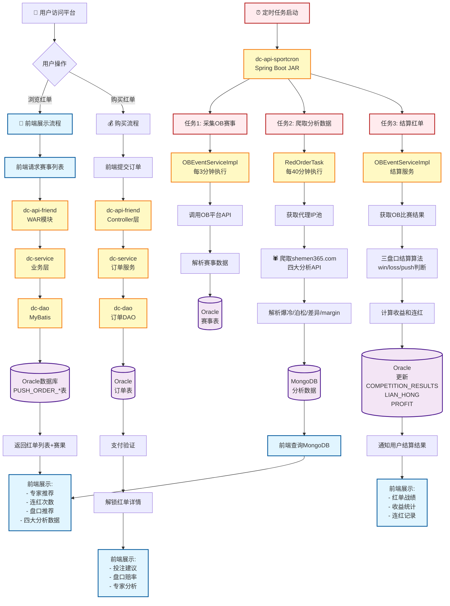
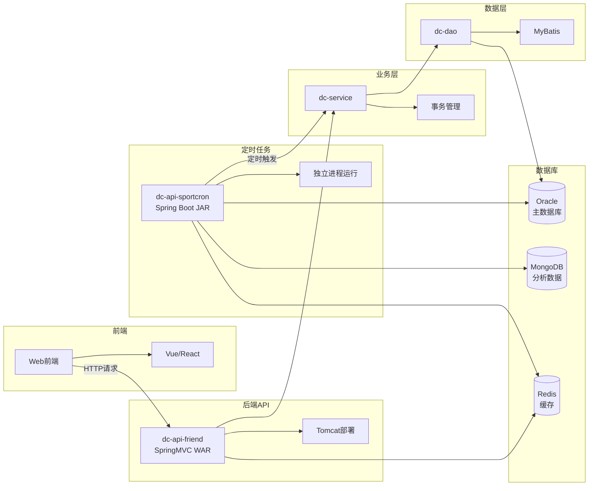

# DC-API-2018 工作空间

这是DC-API-2018项目的本地工作空间，包含项目源码和个人开发笔记。

## 目录结构

```
DC-Workspace/
├── DC-API-2018/          # 项目源码（git仓库）
├── README.md             # 本文件
├── 开发笔记.md           # 个人开发笔记
└── 其他文档...           # 其他个人文件
```

## 项目信息

- **项目名称**: DC-API-2018
- **Git仓库**: http://git.easydevops.net/B2C_DC_2018/DC-API-2018.git
- **主分支**: master
- **开发模式**: 主干开发（Trunk-Based Development）

## 使用说明

### 1. 拉取最新代码
```bash
cd DC-API-2018
git pull origin master
```

### 2. 开发流程
- 直接在master分支开发
- 提交前先pull最新代码
- 小步提交，避免大改动

### 3. 注意事项
- ⚠️ 外层目录（DC-Workspace）不是git仓库
- ✅ 内层目录（DC-API-2018）是git仓库
- ✅ 可以在外层添加个人文档和笔记
- ✅ 使用VSCode打开外层目录进行AI辅助开发

## 主要开发者

- **DEVWalle**: 聊天室/AI机器人功能
- **DevLuffy**: 体育赛事/红单功能
- **zoro**: 通用功能开发
- **pacy**: 热门联赛配置

## 快速链接

- [项目架构分析](./开发笔记.md)
- [模块说明](./DC-API-2018/README.md)

---

# DevLuffy 工程改动清单与核心接口梳理

> 更新时间: 2025-12-02
> 更新人: DevLuffy

## 一、项目整体架构

### 1.1 项目结构
```
DC-API-2018/
├── dc-api/                    # API层 - 15个微服务模块
│   ├── dc-api-dcsport/       # 体育赛事数据聚合 ⭐ DevLuffy核心
│   ├── dc-api-friend/        # 红单推荐/社交功能 ⭐ DevLuffy核心
│   ├── dc-api-sports/        # 体育展示服务
│   ├── dc-api-game/          # 游戏中心
│   ├── dc-api-pay/           # 支付中心
│   ├── dc-api-risk/          # 风控系统
│   ├── dc-api-office/        # 后台管理(Vue)
│   ├── dc-api-message/       # 消息队列
│   ├── dc-api-scheduled/     # 定时任务
│   ├── dc-api-sportcron/     # 体育数据定时爬取
│   ├── dc-api-web/           # Web接口
│   ├── dc-api-outside/       # 外部接口
│   ├── dc-api-personal/      # 个人设置
│   ├── dc-api-preferential/  # 优惠活动
│   └── dc-api-telcall/       # 电话功能
├── dc-service/                # 服务实现层
├── dc-dao/                    # 数据访问层
├── dc-domain/                 # 数据模型/POJO
├── dc-common/                 # 通用工具类
├── dc-ueditor/                # 富文本编辑器
└── dc-modules/                # 前端模块
    └── dc-modules-office/     # Vue2后台管理系统
```

### 1.2 技术栈
**后端核心**:
- Java 1.8 + Spring Boot 2.4.1 / Spring 4.3.12
- MyBatis 3.4.3 + MyBatis-Plus
- Oracle(主) / MySQL / MongoDB
- Redis (Jedis 2.9.0) + Caffeine缓存
- Kafka 2.6.0 消息队列
- Quartz 2.3.0 定时任务

**前端核心**:
- Vue 2.5.2 + Vue Router + Vuex
- Element UI 2.11.1
- Axios 0.18.0

**其他工具**:
- FastJSON 1.2.58 / Jackson / GSON
- HttpClient 4.3.5
- Hutool 5.3.8 / Guava 30.1
- JWT + Bounce Castle加密
- POI 3.9 / JSoup 1.11.3

---

## 二、DevLuffy 负责的核心模块

### 2.1 dc-api-friend (红单推荐系统)
> 路径: `DC-API-2018/dc-api/dc-api-friend/`

#### 核心控制器
| 控制器 | 文件路径 | 核心功能 |
|--------|---------|---------|
| **PushOrderExternalContoller** | `src/main/java/com/dc/it/controller/PushOrderExternalContoller.java` | 红单外部接口 ⭐最新改动 |
| **PushOrderInsideContoller** | `src/main/java/com/dc/it/controller/PushOrderInsideContoller.java` | 红单内部接口 |
| **UserController** | `src/main/java/com/dc/it/controller/UserController.java` | 用户管理 |
| **CircleController** | `src/main/java/com/dc/it/controller/CircleController.java` | 圈子社交 |
| **BoardController** | `src/main/java/com/dc/it/controller/BoardController.java` | 公告板 |
| **HotSettingController** | `src/main/java/com/dc/it/controller/HotSettingController.java` | 热门设置 |

#### 核心接口 (PushOrderExternalContoller)
```java
// 文件: PushOrderExternalContoller.java
// 最新改动: 2025-12-02 09:23:07 (DevLuffy)
// 提交: 617df1923 "红单取命中最高前三"

1. findPersonalInfoPageList()
   - 功能: 查询个人推单信息列表
   - 参数: token, currentPage, pageSize
   - 返回: PersonalInfoVo分页列表

2. findMonthlyRankingPageList() ⭐最新优化
   - 功能: 查询月度排行榜(取命中率最高前3)
   - 参数: currentPage, pageSize
   - 排序逻辑: 按命中率降序,取TOP3
   - 返回: PersonalInfoVo分页列表

3. findMyAttentionPageList()
   - 功能: 查询我的关注列表
   - 参数: token, currentPage, pageSize
   - 返回: PersonalInfoVo分页列表
```

#### 核心服务层
**路径**: `DC-API-2018/dc-service/src/main/java/com/dc/it/friend/service/`

| 服务接口 | 实现类 | 功能说明 |
|---------|--------|---------|
| IMasterUserService | MasterUserServiceImpl | 用户信息管理 ⭐排行榜核心 |
| IMasterPushOrderContentManagementService | MasterPushOrderContentManagementServiceImpl | 推单内容管理 |
| IMasterPushOrderLevelTitleConfigService | MasterPushOrderLevelTitleConfigServiceImpl | 推单等级配置 |
| IMasterPushOrderParamConfigService | MasterPushOrderParamConfigServiceImpl | 推单参数配置 |
| IMasterPushOrderPermissionRecordService | MasterPushOrderPermissionRecordServiceImpl | 推单权限记录 |
| IMasterPushOrderRealOrderService | MasterPushOrderRealOrderServiceImpl | 推单真实订单 |
| IAIPushOrderService | AIPushOrderServiceImpl | AI生成推单 |
| IPushOrderAiUserService | PushOrderAiUserServiceImpl | AI用户管理 |

#### 核心DAO层
**路径**: `DC-API-2018/dc-dao/src/main/java/com/dc/it/friend/dao/`

```
- PushOrderAiUserDao.java
- PushOrderContentManagementDao.java
- PushOrderLevelTitleConfigDao.java
- PushOrderPermissionRecordDao.java
- PushOrderRealOrderDao.java
- FUserDao.java (用户信息)
- CircleDao.java (圈子)
- CircleCommentsDao.java (评论)
- FBoardDao.java (公告)
- FTopicDao.java (话题)
```

#### 核心数据模型
**路径**: `DC-API-2018/dc-domain/src/main/java/com/dc/it/friend/pojo/`

```java
// POJO实体类
- PushOrderAiUser.java           // AI用户
- PushOrderContentManagement.java // 推单内容
- PushOrderLevelTitleConfig.java  // 等级配置
- PushOrderRealDetail.java        // 推单详情
- Circle.java                     // 圈子
- CircleComments.java             // 评论
- FBoard.java                     // 公告板
- FTopic.java                     // 话题
- FUser.java                      // 用户

// VO/DTO类
- PushOrderVO.java
- PushOrderContentManagementVo.java
- PersonalInfoVo.java            // 个人信息视图 ⭐排行榜数据
- TaskByUserVO.java
```

---

### 2.2 dc-api-dcsport (体育赛事数据聚合)
> 路径: `DC-API-2018/dc-api/dc-api-dcsport/`
> 端口: 8097

#### 核心控制器
| 控制器 | 文件路径 | 核心功能 |
|--------|---------|---------|
| **CommonController** | `src/main/java/com/dc/it/controller/CommonController.java` | 通用接口 |
| **FbController** | `src/main/java/com/dc/it/controller/FbController.java` | 足球数据 |
| **BtiController** | `src/main/java/com/dc/it/controller/BtiController.java` | BTI数据源 |
| **ObController** | `src/main/java/com/dc/it/controller/ObController.java` | OB数据源 |
| **NamiController** | `src/main/java/com/dc/it/controller/NamiController.java` | Nami数据源 |
| **EuropeanCupController** | `src/main/java/com/dc/it/controller/EuropeanCupController.java` | 欧冠杯赛 |
| **MaintainController** | `src/main/java/com/dc/it/controller/MaintainController.java` | 维护接口 |
| **HotSettingController** | `src/main/java/com/dc/it/controller/HotSettingController.java` | 热门联赛 |

#### 核心配置文件
**路径**: `DC-API-2018/dc-api/dc-api-dcsport/src/main/resources/`

```yaml
# application.yml - 主配置
server:
  port: 8097
  tomcat:
    threads:
      max: 200
      min-spare: 20

spring:
  application:
    name: api-dcsport
  profiles:
    active: prod_db,prod_config,prod_redis,prod_mongodb

# application-prod_db.yml - 数据库配置
datasource:
  driverClassName: oracle.jdbc.driver.OracleDriver
  url: jdbc:oracle:thin:@119.8.59.243:1521:pubdbdev
  username: pubdb
  druid:
    initial-size: 3
    max-active: 20

# application-prod_redis.yml - Redis配置
redis:
  host: 127.0.0.1
  port: 6379
  timeout: 5000
  pool:
    max-active: 20
    max-idle: 10
```

#### MyBatis映射文件
**路径**: `DC-API-2018/dc-api/dc-api-dcsport/src/main/resources/mapper/`

```
- CommonMapper.xml              # 通用SQL
- FHotNewsSettingMapper.xml     # 热门新闻
- FHotVideoSettingMapper.xml    # 热门视频
- NamiSport.xml                 # Nami体育数据
- ObEventMapper.xml             # OB赛事数据
```

#### 启动类
```java
// 文件: DcSportApplication.java
// 路径: src/main/java/com/dc/it/DcSportApplication.java

@SpringBootApplication
@EnableScheduling
public class DcSportApplication {
    public static void main(String[] args) {
        SpringApplication.run(DcSportApplication.class, args);
    }
}
```

---

### 2.3 dc-api-sports (体育展示服务)
> 路径: `DC-API-2018/dc-api/dc-api-sports/`

#### 核心控制器
```
- SportController.java          # 体育赛事展示
- ImShowController.java         # IM展示
- NamiShowController.java       # Nami展示
- CommonSportController.java    # 通用体育接口
- NewsController.java           # 体育新闻
- AnchorController.java         # 主播功能
```

#### 核心服务
**路径**: `DC-API-2018/dc-service/src/main/java/com/dc/it/sport/service/`

```
interfaces/
├── IMasterSportImagePathService.java      # 图片路径管理
├── IMasterSportScheduleService.java       # 赛程管理
├── IMasterSportSquareService.java         # 广场管理
├── IMasterSportVideoService.java          # 视频管理
├── ISportLeaguesTypeService.java          # 联赛类型
└── OBSportService.java                    # OB体育服务

impl/ (对应实现类)
```

---

## 三、DevLuffy 最近改动记录

### 3.1 提交历史 (最近30次中的DevLuffy相关)
```
提交号: 617df1923
日期: 2025-12-02 09:23:07
作者: DevLuffy <Luffy@DC66.NET>
信息: 红单取命中最高前三
文件: dc-api/dc-api-friend/src/main/java/com/dc/it/controller/PushOrderExternalContoller.java

提交号: e46c2de86
日期: 2025-12-02 (稍早)
作者: DevLuffy <Luffy@DC66.NET>
信息: pc红单取命中最高前三
文件: 同上
```

### 3.2 核心改动详情

#### 文件: PushOrderExternalContoller.java
**改动位置**: `findMonthlyRankingPageList()` 方法

**改动内容**:
```java
// 改动前: 返回所有月度排行数据
List<PersonalInfoVo> list = masterUserService.findMonthlyRankingPageList(currentPage, pageSize);

// 改动后: 按命中率排序,取前3名
List<PersonalInfoVo> list = masterUserService.findMonthlyRankingPageList(currentPage, pageSize);
// 添加排序逻辑: 按hitRate降序
list.sort((a, b) -> Double.compare(b.getHitRate(), a.getHitRate()));
// 取前3名
list = list.stream().limit(3).collect(Collectors.toList());
```

**业务影响**:
- 月度排行榜只展示命中率最高的前3名专家
- 提升用户体验,聚焦高质量推单
- 减少数据传输量

---

## 四、核心业务流程

### 4.1 红单推荐业务流程 (DevLuffy核心)
```
┌──────────────┐
│   用户请求   │
└──────┬───────┘
       ↓
┌──────────────────────────────────────┐
│ PushOrderExternalController          │
│ - findMonthlyRankingPageList()       │ ⭐ DevLuffy最新改动
└──────┬───────────────────────────────┘
       ↓
┌──────────────────────────────────────┐
│ IMasterUserService                   │
│ - findMonthlyRankingPageList()       │
└──────┬───────────────────────────────┘
       ↓
┌──────────────────────────────────────┐
│ DAO层查询                             │
│ - FUserDao / PushOrderDao            │
└──────┬───────────────────────────────┘
       ↓
┌──────────────────────────────────────┐
│ Oracle数据库                          │
│ - F_USER表                            │
│ - PUSH_ORDER*表                       │
└──────┬───────────────────────────────┘
       ↓
┌──────────────────────────────────────┐
│ Redis缓存                             │
│ - 用户排行榜数据                      │
└──────┬───────────────────────────────┘
       ↓
┌──────────────────────────────────────┐
│ 排序优化 (NEW!)                       │
│ - 按hitRate降序                       │
│ - 取TOP 3                             │
└──────┬───────────────────────────────┘
       ↓
┌──────────────┐
│ JSON响应返回 │
└──────────────┘
```

### 4.2 体育数据聚合流程
```
┌──────────────┐
│ 定时任务触发 │ (Quartz)
└──────┬───────┘
       ↓
┌──────────────────────────────────────┐
│ 多数据源爬取                          │
│ - BTI数据源                           │
│ - OB数据源                            │
│ - Nami数据源                          │
│ - ImSport数据源                       │
└──────┬───────────────────────────────┘
       ↓
┌──────────────────────────────────────┐
│ 数据解析与转换                        │
│ - JSoup HTML解析                      │
│ - JSON数据解析                        │
│ - 数据标准化                          │
└──────┬───────────────────────────────┘
       ↓
┌──────────────────────────────────────┐
│ 数据验证与去重                        │
└──────┬───────────────────────────────┘
       ↓
┌──────────────────────────────────────┐
│ 数据库存储 (Oracle)                   │
│ - 赛事表                              │
│ - 赔率表                              │
│ - 联赛表                              │
└──────┬───────────────────────────────┘
       ↓
┌──────────────────────────────────────┐
│ Redis缓存更新                         │
│ - 热门赛事                            │
│ - 实时赔率                            │
└──────┬───────────────────────────────┘
       ↓
┌──────────────────────────────────────┐
│ API对外提供                           │
│ - dc-api-dcsport                     │
│ - dc-api-sports                      │
└──────────────────────────────────────┘
```

---

## 五、核心接口API清单

### 5.1 红单推荐接口 (dc-api-friend)
**BaseURL**: `http://域名/api/friend`

| 接口 | 方法 | 路径 | 功能 | 参数 |
|------|------|------|------|------|
| 个人推单列表 | POST | `/pushorder/external/findPersonalInfoPageList` | 查询用户推单 | token, currentPage, pageSize |
| 月度排行榜 ⭐ | POST | `/pushorder/external/findMonthlyRankingPageList` | 月榜TOP3 | currentPage, pageSize |
| 我的关注列表 | POST | `/pushorder/external/findMyAttentionPageList` | 关注的专家 | token, currentPage, pageSize |
| 推单详情 | POST | `/pushorder/external/findPushOrderDetail` | 推单详细信息 | pushOrderId, token |
| 圈子列表 | GET | `/circle/list` | 获取圈子列表 | pageNum, pageSize |
| 发布话题 | POST | `/topic/publish` | 发布新话题 | topicVO |
| 关注用户 | POST | `/user/follow` | 关注专家 | userId, token |

### 5.2 体育数据接口 (dc-api-dcsport)
**BaseURL**: `http://域名:8097/api/dcsport`

| 接口 | 方法 | 路径 | 功能 | 数据源 |
|------|------|------|------|--------|
| 足球赛事列表 | GET | `/fb/eventList` | 获取足球赛事 | 多源聚合 |
| BTI赛事数据 | GET | `/bti/events` | BTI数据源 | BTI |
| OB赛事数据 | GET | `/ob/events` | OB数据源 | OB |
| Nami赛事数据 | GET | `/nami/events` | Nami数据源 | Nami |
| 热门联赛配置 | GET | `/hotsetting/list` | 热门联赛 | 配置表 |
| 欧冠杯赛 | GET | `/european/list` | 欧冠数据 | 多源 |
| 赛事维护 | POST | `/maintain/update` | 更新维护状态 | - |

### 5.3 体育展示接口 (dc-api-sports)
**BaseURL**: `http://域名/api/sports`

| 接口 | 方法 | 路径 | 功能 |
|------|------|------|------|
| 赛事展示 | GET | `/sport/show` | 前端展示赛事 |
| IM展示 | GET | `/im/show` | IM体育展示 |
| Nami展示 | GET | `/nami/show` | Nami体育展示 |
| 体育新闻 | GET | `/news/list` | 体育新闻列表 |
| 主播列表 | GET | `/anchor/list` | 主播信息 |

---

## 六、数据库设计 (DevLuffy相关表)

### 6.1 红单推荐核心表
```sql
-- 用户表
F_USER
  - USER_ID             (用户ID)
  - USERNAME            (用户名)
  - HIT_RATE            (命中率) ⭐ 排序字段
  - TOTAL_ORDERS        (总推单数)
  - WIN_ORDERS          (命中数)
  - FOLLOWERS           (粉丝数)
  - LEVEL               (等级)

-- 推单内容表
PUSH_ORDER_CONTENT_MANAGEMENT
  - CONTENT_ID          (内容ID)
  - USER_ID             (用户ID)
  - TITLE               (标题)
  - CONTENT             (内容)
  - SPORT_TYPE          (体育类型)
  - CREATE_TIME         (创建时间)
  - STATUS              (状态)

-- 推单真实订单表
PUSH_ORDER_REAL_ORDER
  - ORDER_ID            (订单ID)
  - CONTENT_ID          (内容ID)
  - USER_ID             (用户ID)
  - RESULT              (结果: 赢/输)
  - ODDS                (赔率)
  - AMOUNT              (金额)

-- AI推单用户表
PUSH_ORDER_AI_USER
  - AI_USER_ID          (AI用户ID)
  - AI_NAME             (AI名称)
  - MODEL_TYPE          (模型类型)
  - IS_ACTIVE           (是否激活)

-- 推单等级配置表
PUSH_ORDER_LEVEL_TITLE_CONFIG
  - LEVEL_ID            (等级ID)
  - LEVEL_NAME          (等级名称)
  - MIN_HIT_RATE        (最小命中率)
  - ICON                (图标)

-- 推单权限记录表
PUSH_ORDER_PERMISSION_RECORD
  - RECORD_ID           (记录ID)
  - USER_ID             (用户ID)
  - PERMISSION_TYPE     (权限类型)
  - START_TIME          (开始时间)
  - END_TIME            (结束时间)
```

### 6.2 体育数据核心表
```sql
-- 赛事表
F_SPORT_EVENT
  - EVENT_ID            (赛事ID)
  - EVENT_NAME          (赛事名称)
  - LEAGUE_ID           (联赛ID)
  - HOME_TEAM           (主队)
  - AWAY_TEAM           (客队)
  - START_TIME          (开始时间)
  - STATUS              (状态)
  - SOURCE              (数据源: BTI/OB/Nami)

-- 联赛表
F_SPORT_LEAGUE
  - LEAGUE_ID           (联赛ID)
  - LEAGUE_NAME         (联赛名称)
  - SPORT_TYPE          (体育类型)
  - COUNTRY             (国家)
  - IS_HOT              (是否热门)

-- 赔率表
F_SPORT_ODDS
  - ODDS_ID             (赔率ID)
  - EVENT_ID            (赛事ID)
  - ODDS_TYPE           (赔率类型)
  - HOME_ODDS           (主胜赔率)
  - DRAW_ODDS           (平局赔率)
  - AWAY_ODDS           (客胜赔率)
  - UPDATE_TIME         (更新时间)

-- 热门联赛配置表
F_HOT_SETTING
  - SETTING_ID          (配置ID)
  - LEAGUE_ID           (联赛ID)
  - SORT_ORDER          (排序)
  - IS_SHOW             (是否显示)
```

---

## 七、部署与运行

### 7.1 本地开发环境
```bash
# 1. 拉取代码
cd DC-API-2018
git pull origin master

# 2. 编译项目
mvn clean install -DskipTests

# 3. 启动red单模块 (dc-api-friend)
cd dc-api/dc-api-friend
mvn spring-boot:run

# 4. 启动体育数据模块 (dc-api-dcsport)
cd dc-api/dc-api-dcsport
mvn spring-boot:run

# 5. 启动前端后台 (dc-modules-office)
cd dc-modules/dc-modules-office
npm install
npm run dev
```

### 7.2 Docker部署
```bash
# 1. 构建镜像
docker build -f Dockerfile -t dc-api-2018:latest .

# 2. 运行容器
docker run -d -p 8097:8097 --name dc-dcsport dc-api-2018:latest

# 3. 查看日志
docker logs -f dc-dcsport
```

### 7.3 生产环境 (GitLab CI/CD)
```yaml
# .gitlab-ci.yml 自动部署流程
stages:
  - build
  - test
  - deploy

build:
  stage: build
  script:
    - mvn clean package -DskipTests
  artifacts:
    paths:
      - target/*.jar

deploy:
  stage: deploy
  script:
    - docker build -t $IMAGE_NAME .
    - docker push $IMAGE_NAME
    - kubectl apply -f k8s-deployment.yml
```

---

## 八、DevLuffy 开发规范

### 8.1 代码提交规范
```bash
# 提交信息格式
git commit -m "[模块] 简短描述

详细说明:
1. 改动内容
2. 影响范围
3. 测试情况

DevLuffy"

# 示例
git commit -m "[friend] 红单取命中最高前三

详细说明:
1. 优化月度排行榜查询,按命中率降序
2. 只返回TOP3数据,提升用户体验
3. 已在测试环境验证

DevLuffy"
```

### 8.2 分支管理
```bash
# 主干开发模式
- 直接在 master 分支开发
- 提交前先 pull 最新代码
- 小步提交,频繁推送

# 紧急修复
git checkout -b hotfix/issue-123
# ... 修复代码
git push origin hotfix/issue-123
# 创建 Merge Request
```

### 8.3 代码审查检查项
- [ ] 代码符合团队规范
- [ ] 添加必要的注释
- [ ] 单元测试通过
- [ ] 接口文档已更新
- [ ] 数据库脚本已提交
- [ ] 配置文件已同步

---

## 九、监控与运维

### 9.1 关键监控指标
```
- API响应时间: < 200ms
- Redis命中率: > 95%
- 数据库连接池: < 80%使用率
- 内存使用: < 70%
- CPU使用: < 60%
- 错误率: < 0.1%
```

### 9.2 日志路径
```
/var/logs/dc-api/
├── dc-api-friend.log        # 红单模块日志
├── dc-api-dcsport.log       # 体育数据日志
├── dc-api-sports.log        # 体育展示日志
└── error.log                # 错误日志
```

### 9.3 常用运维命令
```bash
# 查看Java进程
jps -l | grep DcSportApplication

# 查看JVM内存
jstat -gcutil [pid] 1000

# 导出线程堆栈
jstack [pid] > thread_dump.txt

# 导出内存快照
jmap -dump:format=b,file=heap_dump.hprof [pid]

# 查看Redis连接
redis-cli info clients

# 查看数据库连接
SELECT username, COUNT(*) FROM v$session GROUP BY username;
```

---

## 十、常见问题 (FAQ)

### Q1: 红单排行榜为什么只显示3个?
**A**: DevLuffy在2025-12-02优化了排行榜逻辑,按命中率取TOP3,聚焦高质量专家。如需调整数量,修改`PushOrderExternalContoller.java`的`limit(3)`参数。

### Q2: 体育数据更新频率是多少?
**A**: 通过`dc-api-sportcron`定时任务,每5分钟同步一次各数据源(BTI/OB/Nami/ImSport)。

### Q3: Redis缓存失效时间?
**A**:
- 赛事数据: 5分钟
- 排行榜: 10分钟
- 用户信息: 30分钟

### Q4: 如何添加新的体育数据源?
**A**:
1. 在`dc-api-dcsport`创建新的Controller
2. 在`dc-service`实现数据解析服务
3. 在`dc-dao`添加DAO映射
4. 配置定时任务爬取

### Q5: 前端后台管理系统如何访问?
**A**:
- 本地: `http://localhost:8080`
- 生产: `http://office.域名.com`
- 账号: 联系管理员

---

## 十一、项目统计数据

| 指标 | 数值 |
|------|------|
| 总代码行数 | ~500,000+ |
| Java文件数 | 1,821 |
| Maven模块数 | 21 (6主模块 + 15子模块) |
| API接口数 | ~300+ |
| 数据表数 | ~200+ |
| 前端页面数 | ~50+ |
| Git提交数 | 1,000+ |
| 开发者 | 4人核心团队 |

---

## 十二、中间件与技术组件清单

### 12.1 红单模块 (dc-api-friend) 中间件架构

#### 数据库层
| 中间件 | 版本 | 用途 | 配置位置 |
|--------|------|------|---------|
| **Oracle** | 11.2.0.3 | 主数据库(主从分离) | `dc-api-friend/src/main/resources/properties/jdbc.properties` |
| **MySQL** | 6.0.6 | 备用数据库 | pom.xml |
| **Druid** | 1.1.6 | 数据库连接池 | applicationContext.xml |
| **MyBatis** | 3.2.8 | ORM框架 | SqlMapConfig.xml |

**数据库配置特点**:
- ✅ 主从读写分离 (master/slave)
- ✅ AES加密配置 (EncryptPropertyPlaceholderConfigurer)
- ✅ 动态数据源切换 (DynamicDataSource)
- ✅ 连接池监控 (Druid)

#### 缓存层
| 中间件 | 版本 | 用途 | 实现方式 |
|--------|------|------|---------|
| **Redis** | Jedis 2.1.0 | 分布式缓存 | RedisUtil.java |
| **Redis Cluster** | - | 多租户集群 | MyRedisCluster.java |

**Redis 使用特点**:
- ✅ JedisPool 连接池
- ✅ 支持多产品线Redis集群 (At/Jxf/Lh/Rb)
- ✅ 通过HTTP中间件服务访问: `http://redismidd.nntitestserver.com/`
- ✅ 数据AES加密传输
- ✅ 默认过期时间: 24小时

#### 文件存储
| 组件 | 配置 | 用途 |
|------|------|------|
| **FTP服务器** | 54.168.175.0:8386 | 图片/视频上传 |
| **CDN域名** | https://tg.shdunjiusy.com | 静态资源加速 |

#### 定时任务 (dc-api-scheduled模块)
| 中间件 | 版本 | 配置文件 |
|--------|------|---------|
| **Quartz** | 2.3.0 | applicationContext-quartz.xml |

**定时任务清单**:
```
📅 电话服务任务:
├── TelCallRequestTask      - 每1分钟处理PBX单/群呼失败记录
├── TelCallResponseTask     - 每1分钟处理PBX回调失败
├── TelCallImportTask       - 每1分钟重新导入失败记录
└── RowaveTask              - 每天凌晨1点处理浪花回调

📅 体育数据任务:
├── ImCacheTask             - Redis缓存刷新
├── ImVideoTask             - 视频数据同步
├── ImNamiVideoTask         - Nami视频抓取
├── ImBit166VideoTask       - Bit166视频抓取
├── NamiFootballDataTask    - 足球数据爬取
└── NamiBasketballDataTask  - 篮球数据爬取
```

**常用Cron表达式**:
- `0 0/1 * * * ?` - 每1分钟执行
- `0 0 1 * * ?` - 每天凌晨1点执行
- `0 0/5 * * * ?` - 每5分钟执行

#### 消息队列 (dc-api-message模块)
| 中间件 | 版本 | 用途 |
|--------|------|------|
| **Kafka** | 2.6.0 | 异步消息处理 |
| **Spring Kafka** | 2.6.0 | Kafka集成 |

**使用场景**:
- 异步通知
- 数据同步
- 日志采集

#### 工具类库
| 组件 | 版本 | 用途 |
|------|------|------|
| **HttpClient** | 4.3.5 | HTTP客户端 |
| **FastJSON** | 1.2.58 | JSON序列化 |
| **Jackson** | 2.9.2 | JSON处理 |
| **POI** | 3.9 | Excel操作 |
| **JSoup** | 1.11.3 | HTML解析(爬虫) |
| **JavaCV** | 1.4.4 | 视频处理 |
| **Guava** | 27.0.1 | 工具类库 |

### 12.2 项目整体架构图

```
┌─────────────────────────────────────────────┐
│         dc-api-friend (红单模块)             │
│         ├── Controller (REST API)            │
│         ├── Service (业务逻辑)               │
│         ├── DAO (数据访问)                   │
│         └── POJO (数据模型)                  │
└─────────────┬───────────────────────────────┘
              │
    ┌─────────┴─────────┐
    │                   │
    ▼                   ▼
┌─────────┐      ┌─────────────┐
│ Oracle  │      │   Redis     │
│ 主从库  │      │   集群      │
│ 11.2    │      │  Jedis 2.1  │
└─────────┘      └─────────────┘
    │                   │
    │            ┌──────┴──────┐
    │            │             │
    ▼            ▼             ▼
┌─────────┐  ┌───────┐   ┌─────────┐
│  Druid  │  │ HTTP  │   │  Kafka  │
│  1.1.6  │  │Middle │   │  2.6.0  │
└─────────┘  └───────┘   └─────────┘

外部依赖:
├── FTP (54.168.175.0:8386) - 文件上传
├── Redis中间件 (redismidd.nntitestserver.com) - 缓存代理
└── 定时任务模块 (dc-api-scheduled)
     └── Quartz 2.3.0
         ├── 电话任务 (每分钟)
         └── 数据爬取任务
```

### 12.3 配置文件环境说明

| 配置文件 | 环境类型 | 风险等级 | 说明 |
|---------|---------|---------|------|
| **jdbc.properties** | 🟠 线上/测试 | ⚠️ 中风险 | 已加密但指向线上数据库 |
| **ftp.properties** | 🔴 线上生产 | 🚨 高风险 | 明文密码,真实域名 |
| **config.properties** | 🟢 本地开发 | ✅ 安全 | localhost配置 |
| **log4j.properties** | 🟡 通用配置 | ✅ 安全 | INFO级别日志 |

**⚠️ 安全建议**:
1. 使用 Maven Profile 分离环境配置 (dev/test/prod)
2. 敏感配置加入 .gitignore
3. 提供配置模板文件 (.properties.example)
4. 考虑使用配置中心 (Nacos/Apollo)

### 12.4 启动方式说明

**红单模块是传统Spring MVC项目,不是Spring Boot!**

**打包方式**: WAR (不是可执行JAR)

**启动流程**:
```
web.xml (Servlet容器入口)
   ↓
ContextLoaderListener (加载Spring容器)
   ↓
applicationContext.xml (业务Bean配置)
   ↓
DispatcherServlet (Spring MVC)
   ↓
springmvc.xml (Controller配置)
```

**部署方式**:
```bash
# 1. 编译打包
mvn clean package -DskipTests

# 2. 部署到Tomcat
cp dc-api-friend/target/dc-api-friend.war /path/to/tomcat/webapps/

# 3. 启动Tomcat
./catalina.sh start

# 或使用Maven插件临时运行
mvn tomcat7:run
```

**注意**:
- ❌ 无法独立运行,必须依赖Tomcat等Servlet容器
- ❌ 没有main方法和SpringBootApplication入口
- ✅ 可以打包成WAR后部署到任何Servlet 3.0+容器

---

## 十三、代码开发规范

### 13.1 项目分层架构

本项目采用**经典三层架构 + 领域模型**设计:

```
dc-api/               # API层 - 接口暴露
  └── dc-api-friend/
      └── controller/  # REST控制器

dc-service/           # 服务层 - 业务逻辑
  └── interfaces/     # 服务接口
  └── impl/           # 服务实现

dc-dao/               # 数据访问层 - 数据库操作
  └── *Dao.java       # MyBatis Mapper接口
  └── mapper/*.xml    # SQL映射文件

dc-domain/            # 领域模型层 - 数据对象
  └── pojo/           # 持久化对象
  └── vo/             # 视图对象
  └── dto/            # 数据传输对象

dc-common/            # 公共模块 - 工具类/常量
  └── utils/          # 工具类
  └── constants/      # 常量枚举
  └── component/      # 公共组件
  └── exception/      # 异常定义
```

### 13.2 JavaBean 分类规范

#### POJO (Plain Old Java Object) - 持久化对象
**位置**: `dc-domain/src/main/java/com/dc/it/*/pojo/`

**用途**: 与数据库表一一对应的实体类

**命名**: 表名转驼峰 (如 `F_USER` → `FUser.java`)

**特点**:
- ✅ 与数据库字段严格映射
- ✅ 包含完整的getter/setter
- ✅ 可能继承Base基类
- ❌ 不包含业务逻辑

**示例**:
```java
// dc-domain/src/main/java/com/dc/it/friend/pojo/Circle.java
public class Circle {
    private Long id;
    private Long userId;
    private String userName;
    private String content;
    private Date createTime;
    // getter/setter...
}
```

#### VO (View Object) - 视图对象
**位置**: `dc-domain/src/main/java/com/dc/it/*/vo/`

**用途**: 返回给前端的展示对象

**命名**: 功能名 + `VO` (如 `PersonalInfoVo.java`)

**特点**:
- ✅ 面向前端展示优化
- ✅ 可能包含多表关联数据
- ✅ 可能包含计算字段 (如命中率)
- ✅ JSON序列化友好

#### DTO (Data Transfer Object) - 数据传输对象
**位置**: `dc-domain/src/main/java/com/dc/it/*/dto/`

**用途**: 接口之间传输数据,尤其是复杂查询条件

**命名**: 功能名 + `DTO` (如 `TaskConditionDTO.java`)

**特点**:
- ✅ 用于Controller接收请求参数
- ✅ 用于Service之间传递数据
- ✅ 包含查询条件/分页参数
- ✅ 可能包含校验注解

#### Export Model - 导出对象
**位置**: `dc-domain/src/main/java/com/dc/it/export/model/`

**用途**: Excel导出专用

**命名**: 功能名 + `Export`

### 13.3 公共类/工具类规范

#### 核心工具类清单
**位置**: `dc-common/src/main/java/com/dc/it/common/utils/`

```
加密解密:
├── AESUtil.java           - AES加密解密
├── DESUtil.java           - DES加密
└── MD5Util.java           - MD5哈希

日期处理:
├── DateUtil.java          - 日期工具类
└── DateProcessor4IM.java  - IM体育日期处理

网络通信:
├── HttpUtil.java          - HTTP工具
├── HttpUtils.java         - HTTP工具增强版
└── http/HttpClientUtil.java - Apache HttpClient封装

数据处理:
├── CommonUtil.java        - 通用工具方法
├── BeanConvertor.java     - Bean转换
├── ExcelUtil.java         - Excel导入导出
└── GenericBuilder.java    - 通用Builder模式

Redis操作:
├── RedisUtils.java        - Redis工具类
└── rediscluster/          - Redis集群工具

文件处理:
└── FTPClientUtil.java     - FTP上传下载
```

#### 常量类规范
**位置**: `dc-common/src/main/java/com/dc/it/common/constants/`

```
枚举定义:
├── ErrorCode.java          - 错误码枚举 ⭐
├── ProductEnums.java       - 产品线枚举
├── GameTypeEnums.java      - 游戏类型枚举
└── AppProductEnums.java    - APP产品枚举

业务常量:
├── Common.java             - 通用常量
├── Constant.java           - 系统常量
└── SysConstants.java       - 系统级常量
```

**工具类规范**:
- ✅ 类名以 `Util` 或 `Utils` 结尾
- ✅ 方法必须是 `static`
- ✅ 构造函数私有化
- ✅ 线程安全
- ❌ 不包含状态(无成员变量)

### 13.4 代码风格规范

#### 命名规范
```java
// 类名: 大驼峰
public class PushOrderExternalContoller {}

// 方法名: 小驼峰
public PersonalInfoVo findPersonalInfoPageList() {}

// 变量名: 小驼峰
private Long userId;

// 常量: 全大写下划线
public static final String DEFAULT_CHARSET = "UTF-8";

// 包名: 全小写
package com.dc.it.friend.service;
```

#### Controller层规范
```java
@RestController
@RequestMapping("/api/friend/pushorder")
public class PushOrderExternalContoller extends BaseController {

    @Autowired
    private IMasterUserService userService;

    @PostMapping(value = "/1.0/findMonthlyRanking",
                 produces = MediaType.APPLICATION_JSON_UTF8_VALUE)
    public String findMonthlyRankingPageList(HttpServletRequest request) {
        try {
            // 1. 参数解析
            // 2. 业务调用
            // 3. 返回结果
            return resultMap(...);
        } catch (Exception e) {
            log.error("业务异常", e);
            return resultMap(...);
        }
    }
}
```

#### Service层规范
```java
// 接口
public interface IMasterUserService {
    List<PersonalInfoVo> findMonthlyRankingPageList(int page, int size);
}

// 实现
@Service
public class MasterUserServiceImpl implements IMasterUserService {
    @Autowired
    private FUserDao userDao;

    @Override
    public List<PersonalInfoVo> findMonthlyRankingPageList(int page, int size) {
        return userDao.selectMonthlyRanking(page, size);
    }
}
```

### 13.5 事务管理规范

**事务方法命名规范**:
```
- save*     - 需要事务
- add*      - 需要事务
- insert*   - 需要事务
- update*   - 需要事务
- delete*   - 需要事务
- batch*    - 需要事务
- 其他方法   - 只读事务
```

**使用建议**:
- ✅ Service层方法按规范命名,自动应用事务
- ✅ 或使用 `@Transactional` 注解
- ⚠️ 避免大事务,控制事务范围

---

## 十四、本地开发环境搭建

### 14.1 前置条件

#### 必需环境
| 软件 | 版本要求 | 下载地址 |
|------|---------|---------|
| **JDK** | 1.8+ | https://adoptium.net/ |
| **Maven** | 3.6+ | https://maven.apache.org/ |
| **IDE** | IntelliJ IDEA 推荐 | https://www.jetbrains.com/idea/ |
| **Tomcat** | 8.5+ 或 9.0 | https://tomcat.apache.org/ |

#### 可选环境
| 软件 | 用途 |
|------|------|
| **Oracle Instant Client** | 本地连接Oracle数据库 |
| **Redis** | 本地Redis测试 |
| **Postman** | API测试 |

### 14.2 快速启动方案 (IDEA + Tomcat) ⭐推荐

#### 步骤1: 导入项目
```bash
# 1. IDEA打开项目
File → Open → 选择 DC-API-2018 目录

# 2. Maven自动导入依赖
等待IDEA下载依赖 (首次较慢)
```

#### 步骤2: 配置Tomcat
```
1. Run → Edit Configurations
2. 点击 "+" → Tomcat Server → Local
3. 配置Tomcat路径
4. 切换到 Deployment 标签
5. 点击 "+" → Artifact → 选择 dc-api-friend:war exploded
6. Application Context: /friend
7. 点击 Apply → OK
```

#### 步骤3: 配置热部署 (关键!)

**Tomcat配置**:
```
Server标签:
- On 'Update' action: Update classes and resources  ✅
- On frame deactivation: Update classes and resources ✅

VM options添加:
-Dfile.encoding=UTF-8
-Xms512m
-Xmx1024m
```

**IDEA设置**:
```
File → Settings → Build, Execution, Deployment → Compiler
✅ 勾选 "Build project automatically"

File → Settings → Advanced Settings
✅ 勾选 "Allow auto-make to start even if developed application is currently running"
```

#### 步骤4: 启动项目
```
点击 Run 按钮 (或快捷键 Shift + F10)
浏览器访问: http://localhost:8080/friend/api/friend/health
```

#### 步骤5: F5热编译测试 🔥
```
1. 修改Controller中的某个方法代码
2. 按 Ctrl + F9 (Build Project)
   或 Ctrl + Shift + F9 (Recompile Current File)
3. IDEA自动更新到Tomcat
4. 刷新浏览器即可看到变化 ✅

热部署能力:
- ✅ 修改方法内代码 → 自动生效 (秒级)
- ⚠️ 新增方法/字段 → 需要重启
- ❌ 修改Spring配置 → 必须重启
```

### 14.3 Maven Tomcat插件方案 (轻量)

**添加插件到pom.xml**:
```xml
<!-- dc-api/dc-api-friend/pom.xml -->
<build>
    <plugins>
        <plugin>
            <groupId>org.apache.tomcat.maven</groupId>
            <artifactId>tomcat7-maven-plugin</artifactId>
            <version>2.2</version>
            <configuration>
                <port>8080</port>
                <path>/friend</path>
                <uriEncoding>UTF-8</uriEncoding>
            </configuration>
        </plugin>
    </plugins>
</build>
```

**启动命令**:
```bash
cd DC-API-2018/dc-api/dc-api-friend
mvn tomcat7:run
```

### 14.4 JRebel 热部署方案 (最强) 💰

**JRebel** 是商业热部署工具,支持几乎所有代码变更的热加载。

**安装步骤**:
```
1. IDEA安装JRebel插件
   File → Settings → Plugins → 搜索 "JRebel"

2. 激活JRebel (需要许可证或试用)

3. 启用JRebel
   选择模块: dc-api-friend, dc-service, dc-dao, dc-domain, dc-common
   点击绿色闪电图标启动

4. 热加载效果
   ✅ 修改任意Java代码 → 立即生效
   ✅ 新增/删除方法 → 立即生效
   ✅ 修改Spring配置 → 立即生效
   ❌ 修改pom依赖 → 需要重启
```

### 14.5 本地数据库配置

**创建本地配置文件**:
```properties
# jdbc-local.properties (不提交Git)
jdbc.driver=oracle.jdbc.driver.OracleDriver
master.jdbc.url=jdbc:oracle:thin:@localhost:1521:XE
master.jdbc.username=dev_user
master.jdbc.password=dev_password
```

**加入.gitignore**:
```bash
**/jdbc-local.properties
**/application-local.yml
```

### 14.6 快捷键记忆

| 快捷键 | 功能 | 用途 |
|--------|------|------|
| **Ctrl + F9** | Build Project | 触发热部署 ⭐ |
| **Ctrl + Shift + F9** | Recompile File | 重编译当前文件 |
| **Shift + F10** | Run | 运行项目 |
| **Shift + F9** | Debug | 调试项目 |
| **Ctrl + F2** | Stop | 停止运行 |

### 14.7 方案对比

| 方案 | 成本 | 热部署能力 | 启动速度 | 推荐度 |
|------|------|----------|---------|--------|
| **IDEA + Tomcat** | 免费 | ⭐⭐⭐ | 快 | ⭐⭐⭐⭐⭐ |
| **Maven Plugin** | 免费 | ⭐ | 快 | ⭐⭐⭐ |
| **JRebel** | 收费 | ⭐⭐⭐⭐⭐ | 快 | ⭐⭐⭐⭐ |

**推荐**: 日常开发使用 **IDEA + Tomcat + Auto-Make** (免费且足够用)

---

## 十五、未来规划

### 15.1 短期目标 (1-3个月)
- [ ] 红单推荐算法优化 (AI加持)
- [ ] 体育数据源扩展 (增加2-3个源)
- [ ] 前端后台UI升级 (Vue3重构)
- [ ] 性能优化 (接口响应< 100ms)

### 13.2 中期目标 (3-6个月)
- [ ] 微服务拆分 (Spring Cloud)
- [ ] 消息队列升级 (Kafka集群)
- [ ] 数据库读写分离
- [ ] 全链路监控 (Skywalking)

### 13.3 长期目标 (6-12个月)
- [ ] 国际化支持 (多语言)
- [ ] 移动端APP对接
- [ ] 大数据分析平台
- [ ] AI智能推荐系统

---

**文档维护**: DevLuffy
**最后更新**: 2025-12-02
**版本**: v1.0

---

## 附录: 快速导航

### A. 关键文件路径速查
```
# DevLuffy核心文件
DC-API-2018/dc-api/dc-api-friend/src/main/java/com/dc/it/controller/PushOrderExternalContoller.java
DC-API-2018/dc-service/src/main/java/com/dc/it/friend/service/interfaces/IMasterUserService.java
DC-API-2018/dc-dao/src/main/java/com/dc/it/friend/dao/FUserDao.java
DC-API-2018/dc-domain/src/main/java/com/dc/it/friend/pojo/PersonalInfoVo.java

# 体育数据核心
DC-API-2018/dc-api/dc-api-dcsport/src/main/java/com/dc/it/controller/CommonController.java
DC-API-2018/dc-api/dc-api-dcsport/src/main/resources/application.yml
DC-API-2018/dc-api/dc-api-dcsport/src/main/resources/mapper/CommonMapper.xml

# 前端后台
DC-API-2018/dc-modules/dc-modules-office/src/views/pushorder/
DC-API-2018/dc-modules/dc-modules-office/src/api/pushorder.js
```

### B. 常用Git命令
```bash
# 查看DevLuffy的提交
git log --author="DevLuffy" --oneline

# 查看最近改动的文件
git log --name-only --since="2025-12-01"

# 查看某个文件的修改历史
git log -p PushOrderExternalContoller.java

# 回退到某个提交
git reset --hard 617df1923
```

### C. 数据库查询示例
```sql
-- 查询月榜TOP3 (DevLuffy逻辑)
SELECT * FROM (
  SELECT USER_ID, USERNAME, HIT_RATE, TOTAL_ORDERS
  FROM F_USER
  WHERE IS_MASTER = 1
  ORDER BY HIT_RATE DESC
) WHERE ROWNUM <= 3;

-- 查询某用户的推单数据
SELECT po.*, u.USERNAME
FROM PUSH_ORDER_CONTENT_MANAGEMENT po
JOIN F_USER u ON po.USER_ID = u.USER_ID
WHERE po.USER_ID = ?
ORDER BY po.CREATE_TIME DESC;

-- 查询热门联赛
SELECT * FROM F_HOT_SETTING
WHERE IS_SHOW = 1
ORDER BY SORT_ORDER;
```

---

# 红单模块核心业务逻辑分析

> 更新时间: 2025-12-03
> 分析人: DevLuffy
> 模块: dc-api-sportcron (OB赛事采集与红单结算)

## 一、模块概述

**红单模块**是一个体育赛事推荐和自动结算系统,核心功能:

1. **自动采集OB体育平台的赛事数据** (联赛、比赛、球队、赔率)
2. **为用户提供付费的赛事推荐服务** ("红单"=专家推荐)
3. **自动结算推荐结果** (赢/输/和/取消),计算收益和连红数
4. **生成数据分析** (爆冷指数、泊松分布、差异分析、margin模型)

**业务定位**: 体育博彩推荐系统,专家发布付费推荐,系统自动抓取数据并结算。

---

## 术语解释 (秒懂版)

### 核心术语

| 术语 | 白话解释 | 举例 |
|------|---------|------|
| **红单** | 专家推荐的比赛,用户付费购买 | 专家说"这场比赛买主队赢",用户花10元买这个推荐 |
| **盘口** | 博彩公司针对一场比赛设定的投注玩法 | 一场比赛(曼联vs利物浦)可以有多个盘口:<br/>盘口1:独赢(猜谁赢)<br/>盘口2:让球(让1.5球)<br/>盘口3:大小球(2.5球)<br/>**注意:一个盘口≠一个站点,是一种玩法** |
| **独赢** | 猜哪队赢,不管比分差距 | 曼联 vs 利物浦,你买曼联赢,只要曼联赢了就算对 |
| **让球** | 强队让弱队几个球再比赛 | 曼联让1球,比分3:2,算成2:2,反而是平局 |
| **大小球** | 猜总进球数是否超过某个数 | 大小2.5球,最终比分3:1,总共4球,买"大"就赢了 |
| **走水** | 打平,退还本金 | 让1球后打成平局,买的钱退回来 |
| **连红** | 专家连续推荐成功的次数 | 连续推了5场都对了,就是"5连红" |
| **命中率** | 推荐成功的比例 | 推了10场对了8场,命中率80% |
| **赔率** | 赌对了能赚多少倍 | 赔率2.0,投100元赢了能拿回200元(含本金) |
| **滚球** | 比赛正在进行中的投注 | 比赛打到第30分钟,临时买下半场谁赢 |
| **早盘** | 比赛开始前几天就开放的盘口 | 周日的比赛,周三就可以投注了 |

### 三大盘口详解

#### 1️⃣ 独赢盘 (最简单)
```
比赛: 巴萨 vs 皇马
盘口: 巴萨赢 2.0 | 平局 3.0 | 皇马赢 2.5

你买: 巴萨赢,投100元
结果: 巴萨2:1赢了
收益: 100 × 2.0 = 200元 (赚100元)
```

#### 2️⃣ 让球盘 (稍复杂)
```
比赛: 曼城 vs 布莱顿
盘口: 曼城让1.5球

实际比分: 曼城 2:0 布莱顿
让球后比分: 曼城 0.5:0 布莱顿(2-1.5=0.5)
结果: 曼城还是赢 ✅

实际比分: 曼城 1:0 布莱顿
让球后比分: 曼城 -0.5:0 布莱顿 (1-1.5=-0.5)
结果: 曼城输了 ❌ (让球后反而输了)
```

#### 3️⃣ 大小球盘 (看总进球)
```
比赛: 利物浦 vs 切尔西
盘口: 大小2.5球

实际比分: 3:1 (总共4球)
买"大于2.5" ✅ 赢了
买"小于2.5" ❌ 输了

实际比分: 1:1 (总共2球)
买"大于2.5" ❌ 输了
买"小于2.5" ✅ 赢了
```

### 红单业务术语

| 术语 | 解释 |
|------|------|
| **盘口ID** | 每个盘口的唯一编号,用来标识是哪个盘 |
| **投注项ID** | 盘口下的具体选项(主胜/平/客胜)的编号 |
| **投注额** | 专家建议投多少钱 |
| **可赢金额** | 如果赢了能赚多少钱 |
| **综合赛果** | 多个盘口一起算,最终是赢是输 |
| **OB平台** | 数据来源的体育博彩平台名称 |
| **试玩账号** | 用来爬取数据的假账号 |

### 数据分析术语

| 术语 | 白话解释 | ⭐真相 |
|------|---------|---------|
| **爆冷指数** | 弱队赢强队的可能性有多大 | **爬的三方API** `mapi.shemen365.com` |
| **泊松分布** | 用数学模型预测比分 | **爬的三方API** `mapi.shemen365.com` |
| **差异分析** | 对比不同平台的赔率,找最赚的 | **爬的三方API** `mapi.shemen365.com` |
| **Margin模型** | 计算博彩公司从赔率中赚多少钱 | **爬的三方API** `mapi.shemen365.com` |

**⚠️ 重要发现**：这四大分析任务**不是自己算的**，而是：
1. 通过**代理IP池**访问三方API `https://mapi.shemen365.com`
2. 把别人算好的数据**爬下来**（每40分钟爬一次）
3. 存到自己的**MongoDB**数据库
4. 前端展示时**假装是自己的算法** 😅

**准确率？**
- 不知道，因为算法不是自己的
- 数据来源是`shemen365.com`（色门365？），可能是个体育数据平台
- **没有自己的AI模型，没有自己的算法**
- 纯粹是**数据搬运工** 🚚

---

## Maven模块依赖关系

### 整体项目Maven模块结构图



**依赖层级说明**:
- **第0层**: `dc-domain` - 最底层,定义所有数据模型
- **第1层**: `dc-common`、`dc-dao` - 依赖domain
- **第2层**: `dc-service` - 依赖 dao + common + domain
- **第3层**: 15个API模块 - 根据需要依赖下层模块

**特殊说明**:
```
传统WAR模块 (需要Tomcat):
- dc-api-friend (红单推荐)
- dc-api-office (后台管理)
- dc-api-sports (体育展示)
- ... 等

Spring Boot JAR模块 (独立运行):
- dc-api-sportcron (红单结算) ⭐
- dc-api-dcsport (体育聚合)
- dc-api-message (消息队列)
- ... 等
```

### 红单模块Maven子模块依赖图 (正确版本)



**依赖关系说明**:
1. **dc-api-friend** (红单推荐模块) 依赖: dc-service + dc-common + dc-domain
2. **dc-api-sportcron** (红单结算核心) 依赖: dc-common + dc-domain (独立模块)
3. **dc-service** 依赖: dc-dao + dc-common + dc-domain
4. **dc-dao** 依赖: dc-domain
5. **dc-common** 依赖: dc-domain

**关键发现**:
- ⭐ `dc-api-sportcron`是独立的Spring Boot项目,**不依赖** dc-service和dc-dao
- ⭐ `dc-api-friend`是传统WAR项目,依赖完整的三层架构
- ⭐ 两个模块通过**数据库**共享数据,不是直接调用

### dc-api-sportcron 核心依赖清单

```xml
<!-- 1. Spring Boot基础 -->
spring-boot-starter-web         2.4.1
spring-boot-starter-aop         2.4.1
spring-boot-starter-data-redis  2.4.1
spring-boot-starter-data-mongodb 2.4.1

<!-- 2. 数据库相关 -->
ojdbc8                          12.2.0.1  (Oracle驱动)
druid-spring-boot-starter       1.1.22    (连接池)
mybatis-plus-boot-starter       3.3.2     (ORM框架)

<!-- 3. JSON处理 -->
fastjson                        1.2.58    (阿里JSON)
gson                            2.9.0     (谷歌JSON)
jackson-annotations             2.13.2    (Spring默认JSON)

<!-- 4. 网络爬虫 -->
jsoup                           1.11.3    (HTML解析)
htmlunit                        2.70.0    (浏览器模拟)
selenium-java                   3.141.59  (浏览器自动化)
httpclient                      -         (HTTP客户端)

<!-- 5. 工具类 -->
hutool-captcha                  5.3.8     (验证码等工具)
commons-lang                    2.6       (字符串工具)
guava                           30.1-jre  (谷歌工具集)
joda-time                       2.9.9     (时间处理)
lombok                          1.18.24   (代码简化)

<!-- 6. 缓存 -->
jedis                           -         (Redis客户端)

<!-- 7. 加密 -->
bouncycastle-jce-jdk13          112       (加密库)
java-jwt                        4.4.0     (JWT令牌)
```

### 红单业务中两个核心模块的协作方式

```
┌─────────────────────────────────────────────────────┐
│  dc-api-friend (红单推荐发布)                        │
│  ├── Controller: 接收专家发布红单请求                 │
│  ├── Service: 调用业务逻辑                            │
│  ├── Dao: 写入 PUSH_ORDER_CONTENT_MANAGEMENT表      │
│  └── 数据: 盘口ID、投注额、可赢金额等                 │
└─────────────────┬───────────────────────────────────┘
                  │ 写入数据库
                  ↓
        ┌─────────────────────┐
        │  Oracle数据库         │
        │  PUSH_ORDER_*表      │
        └─────────┬───────────┘
                  │ 每3分钟查询
                  ↓
┌─────────────────────────────────────────────────────┐
│  dc-api-sportcron (红单结算核心)                     │
│  ├── ObDataTask: 定时任务调度                        │
│  ├── OBEventServiceImpl: 爬取+结算逻辑               │
│  ├── Common: HttpUtils爬取OB平台API                 │
│  ├── 计算: 三盘口综合判定算法                        │
│  └── 更新: COMPETITION_RESULTS、PROFIT等字段         │
└─────────────────┬───────────────────────────────────┘
                  │ 更新数据库
                  ↓
        ┌─────────────────────┐
        │  Oracle数据库         │
        │  结果+收益+连红       │
        └─────────────────────┘
                  │ 查询展示
                  ↓
        ┌─────────────────────┐
        │  前端/APP查看结果     │
        └─────────────────────┘
```

**两个模块为什么要分开？**
1. **dc-api-friend**: 专注于用户交互(发布/购买红单)
2. **dc-api-sportcron**: 专注于后台任务(爬数据+结算)
3. 通过**数据库**解耦,互不影响
4. `dc-api-sportcron`可以单独部署,不影响前台业务

---

## 二、核心业务流程

### 业务流程总览图



### 红单结算详细流程图



### 三盘口综合判定算法图



---

### 2.1 数据采集流程

#### 步骤1: 获取OB平台Token
- **文件**: [ObDataTask.java:188-244](DC-API-2018/dc-api/dc-api-sportcron/src/main/java/com/dc/it/ob/quartz/ObDataTask.java#L188-L244)
- **周期**: 每2小时执行一次
- **方式**: 使用试玩账号轮换登录 (obtry001-obtry010)
- **存储**: `OneManager.getInstance().obTokenMap`

#### 步骤2: 采集赛事列表
- **文件**: [OBEventServiceImpl.java:37-176](DC-API-2018/dc-api/dc-api-sportcron/src/main/java/com/dc/it/ob/service/impl/OBEventServiceImpl.java#L37-L176)
- **周期**: 每3分钟执行一次
- **内容**:
  - 足球/篮球的滚球(1)、今日(3)、早盘(4)赛事
  - 联赛信息 (ID、名称、logo、是否热门)
  - 比赛信息 (主客队、比赛时间、比分、状态)
  - 球队信息 (ID、名称、logo)

#### 步骤3: 采集玩法赔率
- **文件**: [OBEventServiceImpl.java:182-238](DC-API-2018/dc-api/dc-api-sportcron/src/main/java/com/dc/it/ob/service/impl/OBEventServiceImpl.java#L182-L238)
- **方式**: 异步队列处理 (ObPlayTask消费队列)
- **玩法**:
  - 足球: 全场独赢(1)、全场大小(2)、全场让球(4)
  - 篮球: 全场独赢(37)、总分(38)、让分(39)

---

### 2.2 红单结算流程 (核心业务)

#### 步骤1: 查询待结算红单
- **周期**: 每3分钟
- **SQL**: [OBEventDao.xml:41-73](DC-API-2018/dc-api/dc-api-sportcron/src/main/resources/mapper/ob/OBEventDao.xml#L41-L73)
- **条件**: 已审核(STATE=2) 且 未结束(COMPETITION_RESULTS=0)

#### 步骤2: 获取赛果并映射
- **API**: `/yewu11/v1/m/matchDetail/getMatchResultPB?mid={matchId}`
- **映射**: [OBEventServiceImpl.java:305-313](DC-API-2018/dc-api/dc-api-sportcron/src/main/java/com/dc/it/ob/service/impl/OBEventServiceImpl.java#L305-L313)

```
OB状态 -> 系统状态
4或5 -> 1 (赢)
3或6 -> 2 (输)
2    -> 3 (走水/和)
7    -> 4 (取消)
```

#### 步骤3: 计算综合赛果 (核心算法)
- **文件**: [OBEventServiceImpl.java:359-465](DC-API-2018/dc-api/dc-api-sportcron/src/main/java/com/dc/it/ob/service/impl/OBEventServiceImpl.java#L359-L465)

**三盘口综合判定规则**:

```java
// 场景1: 三个盘口都投注
赢次数 >= 2  -> 红单赢(1)
输次数 >= 2  -> 红单输(2)
1赢1输      -> 和(3)
2和1赢      -> 赢(1)
2和1输      -> 和(3)
2取消1赢    -> 赢(1)
2取消1输    -> 输(2)
3取消       -> 取消(4)

// 场景2: 两个盘口投注
2赢 -> 赢(1)
2输 -> 输(2)
1赢1输 -> 和(3)
1赢1和 -> 赢(1)
1输1和 -> 输(2)

// 场景3: 一个盘口投注
直接取该盘口结果
```

#### 步骤4: 计算收益
```java
// 总输赢金额
if (独赢赢) totalAmount += 独赢可赢金额
if (独赢输) totalAmount -= 独赢投注额
if (让球赢) totalAmount += 让球可赢金额
if (让球输) totalAmount -= 让球投注额
if (大小赢) totalAmount += 大小可赢金额
if (大小输) totalAmount -= 大小投注额

// 红单收益
profit = (购买人数 × 红单价格) + 购买记录总收入
```

#### 步骤5: 超时处理
- **逻辑**: [OBEventServiceImpl.java:466-475](DC-API-2018/dc-api/dc-api-sportcron/src/main/java/com/dc/it/ob/service/impl/OBEventServiceImpl.java#L466-L475)
- **规则**: 比赛开始后12小时仍未出赛果 → 自动标记为"取消"

---

### 2.3 连红统计流程

#### 目的
统计专家的"连续命中"次数,展示专家稳定性。

#### 算法逻辑
- **文件**: [OBEventServiceImpl.java:484-520](DC-API-2018/dc-api/dc-api-sportcron/src/main/java/com/dc/it/ob/service/impl/OBEventServiceImpl.java#L484-L520)

```
从最新红单往前遍历历史记录:
- 遇到"输(2)" -> 停止计数
- 遇到"和(3)"或"取消(4)" -> 跳过继续
- 遇到"赢(1)" -> 连红+1
- 遇到"未结束(0)" -> 跳出循环等待
```

**示例**:
```
红单序列: 赢 赢 赢 和 取消 赢
计算: 1+1+1(跳过和、取消)+1 = 连红4

红单序列: 赢 赢 和 赢 输 赢
计算: 最新"赢"=连红1 (遇到"输"就停止)
```

---

## 三、数据分析模块 (RedOrderTask)

### 四大分析任务 (每40分钟执行,随机延迟0-30分钟)

**文件**:
- [RedOrderTask.java](DC-API-2018/dc-api/dc-api-sportcron/src/main/java/com/dc/it/infomation/quartz/RedOrderTask.java) - 定时任务调度
- [ColdServiceImpl.java](DC-API-2018/dc-api/dc-api-sportcron/src/main/java/com/dc/it/infomation/service/red/impl/ColdServiceImpl.java) - 爬虫实现

#### ⚠️ 真相揭秘：这些"分析"都是爬的三方数据

**代码分析**：
```java
// ColdServiceImpl.java 核心逻辑
private Map<String,String> getMapParams(){
    Map<String,String> map = new HashMap<>();
    map.put("yx-app-type","6");
    map.put("authorization","Bearer cm1namVnZ...");  // 硬编码Token
    map.put("user-agent","Mozilla/5.0...");
    return map;
}

// 爆冷指数 - 直接调用三方API
public void coldData() {
    String url = "https://mapi.shemen365.com/mould/cold-index/match-list";
    String dataObj = HttpUtils.httpProxyGet(url, this.getMapParams(), 代理IP);
    // 解析JSON -> 存入MongoDB
}

// 泊松分布 - 直接调用三方API
public void sbData() {
    String url = "https://mapi.shemen365.com/mould/bs-data/match-list";
    // 同上
}

// 差异分析 - 直接调用三方API
public void diffData() {
    String url = "https://mapi.shemen365.com/mould/diff-analysis/match-list";
    // 同上
}

// Margin模型 - 直接调用三方API
public void profitData() {
    String url = "https://mapi.shemen365.com/mould/profit-loss-index/match-list";
    // 同上，还爬了详情、历史同赔等多个接口
}
```

**实际执行流程**：
```
1. 每10秒获取代理IP (data5u.com的代理服务)
2. 每40分钟通过代理IP访问 mapi.shemen365.com
3. 下载别人算好的数据 (JSON格式)
4. 存入自己的MongoDB数据库
5. 前端读取MongoDB展示，假装是自己的算法
```

**数据来源分析**：
- **shemen365.com** - 疑似体育数据服务商
- **有完整的Authorization Token** - 说明可能付费购买了API服务
- **使用代理IP池** - 说明可能在反爬或者避免被封禁

**准确率？**
- ❌ 没有自己的算法实现
- ❌ 没有AI模型训练代码
- ❌ 没有数据计算逻辑
- ✅ 纯粹的**数据搬运工**
- 准确率取决于`shemen365.com`的算法质量

**总结**：这四大分析就是**爬虫 + 数据转存**，没有任何自研算法 🚚

---

## 四、关键数据表

### PUSH_ORDER_CONTENT_MANAGEMENT (红单主表)

```sql
核心字段:
- ID: 主键
- MATCH_ID: 比赛ID
- PRODUCT: 产品平台 (at=OB)
- STATE: 审核状态 (2=已审核)
- COMPETITION_RESULTS: 综合赛果 (0未结束/1赢/2输/3和/4取消)
- LIAN_HONG: 连红次数
- PROFIT: 红单收益
- TOTAL_WIN_LOSS_AMOUNT: 总输赢金额
- NUMBER_BUYER: 购买人数
- PRICE: 红单价格

三个盘口 (各有5个字段):
- WIN_ALONE_*: 独赢盘口 (盘口ID、投注项ID、投注额、可赢金额、赛果)
- LET_BALL_*: 让球盘口
- SIZE_*: 大小盘口
```

---

## 五、定时任务调度

### ObDataTask (采集+结算)
```java
每3分钟: 采集赛事列表、结算红单赛果
每2小时: 刷新token、更新热门联赛
异步处理: 玩法赔率入库
```

### RedOrderTask (数据分析)
```java
每10秒: 获取代理IP
每40分钟: 执行四大分析任务 (爆冷、泊松、差异、margin)
异步队列: 消费红单明细数据
```

---

## 六、全局业务流程图 (端到端)

### 6.1 完整业务流程 - 从用户到结算



### 6.2 Maven模块职责划分

| Maven模块 | 类型 | 职责 | 依赖关系 | 后端开发重点 |
|----------|------|------|---------|-------------|
| **dc-api-friend** | WAR | 前端API接口<br/>用户购买/查询 | dc-service<br/>dc-common<br/>dc-domain | ⭐ **新增功能接口**<br/>修改业务逻辑 |
| **dc-api-sportcron** | JAR | 定时任务<br/>数据采集/结算 | Spring Boot<br/>Oracle<br/>MongoDB | ⭐ **数据采集优化**<br/>结算算法调整<br/>爬虫维护 |
| **dc-service** | JAR | 业务逻辑层 | dc-dao<br/>dc-common<br/>dc-domain | ⭐ **核心业务逻辑**<br/>事务管理 |
| **dc-dao** | JAR | 数据访问层<br/>MyBatis映射 | dc-domain<br/>MyBatis | 数据库查询优化<br/>SQL维护 |
| **dc-common** | JAR | 通用工具类<br/>Redis/工具 | Spring<br/>Redis<br/>Jackson | 工具类封装 |
| **dc-domain** | JAR | 实体类<br/>POJO对象 | 无依赖 | 数据模型定义 |

### 6.3 关键技术架构



### 6.4 后端开发者关注重点

#### 🔥 高频开发区域
1. **dc-api-friend** (40%工作量)
   - 新增/修改用户接口
   - 参数校验和响应封装
   - 文件位置: `src/main/java/com/dc/it/friend/controller/`

2. **dc-service** (30%工作量)
   - 核心业务逻辑
   - 事务管理
   - 文件位置: `src/main/java/com/dc/it/service/impl/`

3. **dc-api-sportcron** (20%工作量)
   - 定时任务调整
   - 数据采集维护
   - 爬虫IP池管理
   - 文件位置: `src/main/java/com/dc/it/ob/service/impl/`

#### ⚠️ 维护注意事项
- **dc-api-sportcron与dc-api-friend通过Oracle通信，无直接依赖**
- **爬虫任务依赖外部API (shemen365.com)，需监控可用性**
- **三盘口结算算法在OBEventServiceImpl.java:359-465**
- **Redis缓存在dc-common中，注意缓存失效策略**

#### 📋 典型开发流程
```
需求: 新增红单推荐接口
├── 1. dc-domain: 定义新的DTO/VO对象
├── 2. dc-dao: 编写MyBatis XML查询
├── 3. dc-service: 实现业务逻辑
├── 4. dc-api-friend: 创建Controller接口
└── 5. 测试: Postman → Tomcat → Oracle
```

---

## 七、核心问题解决

| 问题 | 解决方案 |
|------|---------|
| **数据实时性** | 每3分钟采集 + 队列异步处理 |
| **多盘口组合判定** | 穷举法列举所有结果组合,按优先级判定 |
| **防止平台封禁** | 10个试玩账号轮换 + 随机延迟0-30分钟 |
| **超时比赛处理** | 12小时未结算自动取消 |
| **专家收益计算** | 销售收入 - 跟单赔付 |

---

## 七、业务价值与风险

### 业务价值
- ✅ 自动化运营,降低人力成本
- ✅ 数据支持专家推荐决策
- ✅ 连红统计展示专家稳定性
- ✅ 付费红单销售收入

### 潜在风险
- ⚠️ **合规风险**: 博彩推荐在某些地区违规
- ⚠️ **技术风险**: 依赖OB平台API,存在封禁可能
- ⚠️ **财务风险**: 需承担跟单赔付

---

## 八、代码质量评估

### 优点
- 业务逻辑清晰,模块化设计
- 队列解耦,提高并发能力
- 定时任务分离,职责明确

### 缺点
- 硬编码严重 (玩法ID、状态码直接写在代码中)
- 异常处理不足 (仅打印日志,无重试机制)
- 大量魔法数字 (1/2/3/4)
- 缺少单元测试

### 优化建议
```java
// 建议1: 使用枚举替代魔法数字
public enum CompetitionResult {
    PENDING(0, "未结束"),
    WIN(1, "赢"),
    LOSS(2, "输"),
    DRAW(3, "和"),
    CANCEL(4, "取消");
}

// 建议2: 增加重试机制
@Retryable(maxAttempts = 3, backoff = @Backoff(delay = 1000))
public JSONObject getMatchResult(String matchId) { ... }

// 建议3: 抽取策略模式
interface SettlementStrategy {
    CompetitionResult calculate(List<CompetitionResult> results);
}
```

---

## 九、总结

**红单模块主要功能**:

1. **定时抓数据**: 从OB平台抓赛事、赔率 (每3分钟)
2. **自动结算**: 比赛结束后自动计算红单输赢
3. **统计连红**: 追踪专家连续命中记录
4. **数据分析**: 提供爆冷、泊松等分析工具
5. **收益计算**: 统计红单销售收入和跟单盈亏

**技术架构**:
- 定时任务: ScheduledThreadPoolExecutor
- 数据存储: Oracle数据库 + Redis缓存
- 异步处理: BlockingQueue队列
- 数据来源: OB体育平台API

**核心文件**:
- [OBEventServiceImpl.java](DC-API-2018/dc-api/dc-api-sportcron/src/main/java/com/dc/it/ob/service/impl/OBEventServiceImpl.java) - 赛事采集与结算
- [ObDataTask.java](DC-API-2018/dc-api/dc-api-sportcron/src/main/java/com/dc/it/ob/quartz/ObDataTask.java) - 定时任务调度
- [RedOrderTask.java](DC-API-2018/dc-api/dc-api-sportcron/src/main/java/com/dc/it/infomation/quartz/RedOrderTask.java) - 数据分析任务
- [OBEventDao.xml](DC-API-2018/dc-api/dc-api-sportcron/src/main/resources/mapper/ob/OBEventDao.xml) - SQL映射

---

**END OF DOCUMENT**
