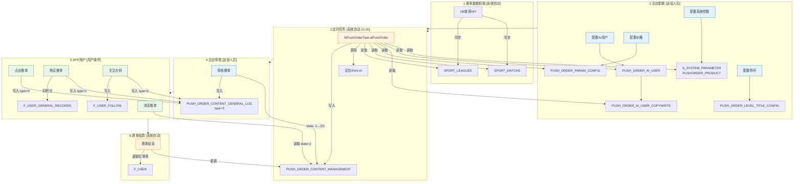

# AI推单系统完整业务流程图

> 本文档梳理 `AIPushOrderTask.aiPushOrder` 定时任务与后台配置、APP端操作、赛事数据抓取之间的完整关系

---

## 一、Mermaid流程图 (快速概览)



---

## 二、数据库表关系图 (ASCII)

```
┌─────────────────────────────────────────────────────────────────────────────────────────────────────────┐
│                                         数据库表关系总览                                                 │
└─────────────────────────────────────────────────────────────────────────────────────────────────────────┘

┌─────────────────────────────────────────────────────────────────────────────────────────────────────────┐
│  【赛事数据层】外部数据抓取 ─ 系统自动                                                                    │
├─────────────────────────────────────────────────────────────────────────────────────────────────────────┤
│  ┌─────────────────────┐      ┌─────────────────────┐      ┌─────────────────────┐                     │
│  │    SPORT_LEAGUES    │      │    SPORT_MATCHS     │      │     OB_EVENT        │                     │
│  │    (联赛信息表)      │◄────►│    (赛事信息表)      │◄────►│   (OB赛事源数据)     │                     │
│  │  - league_id        │      │  - match_id ⭐       │      │  - event_id         │                     │
│  │  - league_name      │      │  - league_id (FK)   │      │  - odds             │                     │
│  │  - sport_id(1足2篮) │      │  - home_team_name   │      │  - match_time       │                     │
│  └─────────────────────┘      │  - away_team_name   │      └─────────────────────┘                     │
│                               │  - match_time       │                                                   │
│                               │  - odds (赔率JSON)  │                                                   │
│                               │  - status_id        │                                                   │
│                               └─────────────────────┘                                                   │
└─────────────────────────────────────────────────────────────────────────────────────────────────────────┘
                                              │
                                              │ 定时任务读取
                                              ▼
┌─────────────────────────────────────────────────────────────────────────────────────────────────────────┐
│  【后台配置层】运营人员配置                                                                               │
├─────────────────────────────────────────────────────────────────────────────────────────────────────────┤
│  ┌─────────────────────┐      ┌─────────────────────┐      ┌─────────────────────┐                     │
│  │  S_SYSTEM_PARAMETER │      │  PUSH_ORDER_AI_USER │      │ PUSH_ORDER_AI_USER  │                     │
│  │    (系统参数表)      │      │    (AI推单用户表)    │─────►│    _COPYWRITE       │                     │
│  │ ─────────────────── │      │ ─────────────────── │      │   (AI文案配置表)     │                     │
│  │ PUSHORDER_PRODUCT   │      │  - id ⭐            │      │ ─────────────────── │                     │
│  │ = "qm,qy,at"        │      │  - user_name        │      │  - poauid (FK)      │                     │
│  │ (启用推单的产品)     │      │  - product          │      │  - ai_type          │                     │
│  └─────────────────────┘      │  - user_type(0/1)   │      │    (0豆包/1Kimi)    │                     │
│                               │  - push_quantity    │      │  - copywrite        │                     │
│  ┌─────────────────────┐      │  - skip_approve     │      │  - match_type       │                     │
│  │PUSH_ORDER_PARAM     │      │  - status(0启/1禁)  │      └─────────────────────┘                     │
│  │    _CONFIG          │      └─────────────────────┘                                                   │
│  │  (推单价格配置表)    │                                   ┌─────────────────────┐                     │
│  │ ─────────────────── │                                   │PUSH_ORDER_LEVEL     │                     │
│  │  - product ⭐       │                                   │  _TITLE_CONFIG      │                     │
│  │  - price (售价)     │                                   │  (推单称号配置表)    │                     │
│  │  - type             │                                   │  - product          │                     │
│  └─────────────────────┘                                   │  - title_name       │                     │
│                                                            └─────────────────────┘                     │
└─────────────────────────────────────────────────────────────────────────────────────────────────────────┘
                                              │
                                              │ 定时任务读取配置 + 写入推单
                                              ▼
┌─────────────────────────────────────────────────────────────────────────────────────────────────────────┐
│  【推单数据层】核心业务表                                                                                 │
├─────────────────────────────────────────────────────────────────────────────────────────────────────────┤
│  ┌─────────────────────────────────────────────────────────────────────────────────────────────┐       │
│  │              PUSH_ORDER_CONTENT_MANAGEMENT  (推单内容表) ⭐⭐⭐ 核心表                        │       │
│  │  ─────────────────────────────────────────────────────────────────────────────────────────  │       │
│  │  - id                    主键                                                               │       │
│  │  - user_name             推单用户名 ────────────► F_USER.user_name                          │       │
│  │  - product               产品标识(qm/qy/at) ────► 产品隔离字段                               │       │
│  │  - title                 推单标题(AI生成)                                                   │       │
│  │  - push_order_content    推单分析内容(AI生成)                                               │       │
│  │  - price                 售价 ◄── PUSH_ORDER_PARAM_CONFIG                                  │       │
│  │  - match_id              赛事ID ◄── SPORT_MATCHS                                           │       │
│  │  - league_match_id       联赛ID ◄── SPORT_LEAGUES                                          │       │
│  │  - state                 状态: 0编辑 | 1待审核 | 2审核通过✓ | 3审核驳回                     │       │
│  │  - competition_results   赛果: 0未结束 | 1红✓ | 2黑✗ | 3和 | 4取消                         │       │
│  │  - operation_port        来源: 0后台 | 1前端 | 2AI定时 | 3安卓 | 4苹果                      │       │
│  │  - odds                  发布时的赔率数据                                                   │       │
│  │  - create_time           创建时间                                                          │       │
│  └─────────────────────────────────────────────────────────────────────────────────────────────┘       │
└─────────────────────────────────────────────────────────────────────────────────────────────────────────┘
                                              │
                                              │ APP端用户操作
                                              ▼
┌─────────────────────────────────────────────────────────────────────────────────────────────────────────┐
│  【用户交互层】APP端用户数据                                                                              │
├─────────────────────────────────────────────────────────────────────────────────────────────────────────┤
│  ┌─────────────────────┐      ┌─────────────────────┐      ┌─────────────────────┐                     │
│  │       F_USER        │      │PUSH_ORDER_CONTENT   │      │PUSH_ORDER_PERMISSION│                     │
│  │     (用户信息表)     │      │   _GENERAL_LOG ⭐   │      │     _RECORD         │                     │
│  │ ─────────────────── │      │   (推单操作日志表)   │      │  (推单权限记录表)    │                     │
│  │  - user_name        │◄────►│ ─────────────────── │      │ ─────────────────── │                     │
│  │  - product          │      │  - content_mgmt_id  │      │  - user_name        │                     │
│  │  - head_url         │      │  - user_name(卖方)  │      │  - product          │                     │
│  │  - red_order_rate   │      │  - operator_user    │      │  - permission_type  │                     │
│  │    (红单率)         │      │    _name(操作者)    │      └─────────────────────┘                     │
│  └─────────────────────┘      │  - type:            │                                                   │
│                               │    0=点击           │      ┌─────────────────────┐                     │
│  ┌─────────────────────┐      │    1=购买           │      │   F_USER_FOLLOW     │                     │
│  │  F_USER_GENERAL     │      │    2=关注           │      │   (用户关注表)       │                     │
│  │     _RECORDS        │      │    3=审核           │      │ ─────────────────── │                     │
│  │  (用户通用记录表)    │      │    4=领取收益       │      │  - user_name        │                     │
│  │ ─────────────────── │      │  - price            │      │  - follow_user_name │                     │
│  │  - user_name        │      │  - create_time      │      │  - product          │                     │
│  │  - frequency(积分)  │      └─────────────────────┘      └─────────────────────┘                     │
│  └─────────────────────┘                                                                               │
└─────────────────────────────────────────────────────────────────────────────────────────────────────────┘
```

---

## 三、完整业务流程 (按阶段)

### 阶段1: 赛事数据抓取 【系统自动】

```
┌──────────────────────────────────────────────────────────────────────────┐
│  操作主体: 系统定时任务                                                    │
│  触发方式: 定时抓取OB体育数据                                              │
├──────────────────────────────────────────────────────────────────────────┤
│                                                                          │
│   OB体育API ────► 数据同步任务 ────► SPORT_MATCHS (赛事+赔率)             │
│                         │                                                │
│                         └────────► SPORT_LEAGUES (联赛信息)              │
│                                                                          │
│   关键字段: match_id, league_id, odds, match_time, status_id             │
└──────────────────────────────────────────────────────────────────────────┘
```

### 阶段2: 后台运营配置 【运营人员】

```
┌──────────────────────────────────────────────────────────────────────────┐
│  操作主体: 后台运营人员                                                    │
│  操作入口: 后台管理系统 → 朋友圈模块                                        │
├──────────────────────────────────────────────────────────────────────────┤
│                                                                          │
│  步骤1: 系统参数 ─────► S_SYSTEM_PARAMETER                               │
│         │               PUSHORDER_PRODUCT = "qm,qy,at"                   │
│         │                                                                │
│  步骤2: AI用户 ───────► PUSH_ORDER_AI_USER                               │
│         │               user_name, product, push_quantity,               │
│         │               skip_approve, status                             │
│         │                                                                │
│         └──── 文案 ───► PUSH_ORDER_AI_USER_COPYWRITE                     │
│                         ai_type(0豆包/1Kimi), copywrite                  │
│                                                                          │
│  步骤3: 价格配置 ─────► PUSH_ORDER_PARAM_CONFIG                          │
│                         product, price                                   │
│                                                                          │
│  步骤4: 称号配置 ─────► PUSH_ORDER_LEVEL_TITLE_CONFIG                    │
│                         篮球大师 / 足球大师                               │
│                                                                          │
│  前置条件: user_name 需在 F_USER 表中存在                                 │
└──────────────────────────────────────────────────────────────────────────┘
```

### 阶段3: 定时任务执行 【系统自动】

```
┌──────────────────────────────────────────────────────────────────────────┐
│  操作主体: Quartz定时任务                                                  │
│  执行时间: 每天21:00 (aiPushOrder)                                        │
│  代码位置: AIPushOrderTask.aiPushOrder()                                  │
├──────────────────────────────────────────────────────────────────────────┤
│                                                                          │
│  1.读取配置                                                               │
│    ├── S_SYSTEM_PARAMETER ──► 获取产品列表 [qm,qy,at]                    │
│    ├── PUSH_ORDER_AI_USER ──► 获取AI用户 (status=0, user_type='0')       │
│    ├── PUSH_ORDER_AI_USER_COPYWRITE ──► 获取AI提示词                     │
│    └── PUSH_ORDER_PARAM_CONFIG ──► 获取推单价格                          │
│                                                                          │
│  2.查询赛事                                                               │
│    └── SPORT_MATCHS + SPORT_LEAGUES                                      │
│        ├── 查询未来第2天赛事                                              │
│        ├── 过滤: odds有效 & 盘口>=3 & 赔率>1.5                           │
│        └── 热门联赛优先                                                   │
│                                                                          │
│  3.调用AI                                                                 │
│    └── 豆包/Kimi API ──► 生成标题+分析内容                               │
│                                                                          │
│  4.保存推单 ──────────► PUSH_ORDER_CONTENT_MANAGEMENT ⭐                 │
│                         - operation_port = '2' (AI标识)                  │
│                         - state = '2'(免审) 或 '1'(待审)                 │
│                                                                          │
│  日志关键字: "AI推单 定时任务【启动】" / "共成功推单"                       │
└──────────────────────────────────────────────────────────────────────────┘
```

### 阶段4: 后台审核 【运营人员】(skip_approve=0时)

```
┌──────────────────────────────────────────────────────────────────────────┐
│  操作主体: 后台运营人员                                                    │
│  操作入口: 后台系统 → 朋友圈 → 推单内容管理                                 │
│  接口: POST /api/friend/pushOrder/contentManagement/updateState          │
├──────────────────────────────────────────────────────────────────────────┤
│                                                                          │
│       state='1'              state='2'              state='3'            │
│      ┌─────────┐            ┌─────────┐            ┌─────────┐          │
│      │ 待审核   │──通过────►│审核通过  │            │审核驳回  │          │
│      │         │            │ APP可见  │            │ 需修改   │          │
│      │         │──驳回────►│         │            │         │          │
│      └─────────┘            └─────────┘            └─────────┘          │
│           ▲                                                              │
│           │                                                              │
│      定时任务写入                                                         │
│                                                                          │
│  同时写入: PUSH_ORDER_CONTENT_GENERAL_LOG (type='3', 审核记录)           │
│  权限控制: 只能审核自己产品的推单                                          │
└──────────────────────────────────────────────────────────────────────────┘
```

### 阶段5: APP用户操作 【用户】

```
┌──────────────────────────────────────────────────────────────────────────┐
│  操作主体: APP端用户                                                       │
│  接口前缀: /api/friend/pushOrder/external/1.0/*                           │
├──────────────────────────────────────────────────────────────────────────┤
│                                                                          │
│  【浏览推单】                                                              │
│    读取: PUSH_ORDER_CONTENT_MANAGEMENT (state='2')                       │
│    读取: F_USER (头像、红单率)                                            │
│                                                                          │
│  【点击推单】                                                              │
│    写入: PUSH_ORDER_CONTENT_GENERAL_LOG (type='0')                       │
│                                                                          │
│  【购买推单】                                                              │
│    读取: PUSH_ORDER_PARAM_CONFIG (获取价格)                               │
│    更新: F_USER_GENERAL_RECORDS (扣除积分)                                │
│    写入: PUSH_ORDER_CONTENT_GENERAL_LOG (type='1', price, price_type)    │
│                                                                          │
│  【关注大师】                                                              │
│    写入: F_USER_FOLLOW                                                    │
│    写入: PUSH_ORDER_CONTENT_GENERAL_LOG (type='2')                       │
│                                                                          │
│  【领取收益】                                                              │
│    更新: PUSH_ORDER_CONTENT_MANAGEMENT.profit_state                      │
│    写入: PUSH_ORDER_CONTENT_GENERAL_LOG (type='4')                       │
└──────────────────────────────────────────────────────────────────────────┘
```

### 阶段6: 赛事结算 【系统自动】

```
┌──────────────────────────────────────────────────────────────────────────┐
│  操作主体: 系统定时任务                                                    │
│  触发条件: 赛事结束后                                                      │
├──────────────────────────────────────────────────────────────────────────┤
│                                                                          │
│  1. 获取赛果                                                              │
│     读取: SPORT_MATCHS.status / OB赛果API                                │
│                                                                          │
│  2. 更新推单结果                                                          │
│     更新: PUSH_ORDER_CONTENT_MANAGEMENT                                  │
│           - competition_results: 0→1(红)/2(黑)/3(和)/4(取消)            │
│           - profit: 计算收益                                             │
│           - lian_hong: 连红数                                            │
│                                                                          │
│  3. 更新用户数据                                                          │
│     更新: F_USER                                                         │
│           - red_order_rate: 红单率                                       │
└──────────────────────────────────────────────────────────────────────────┘
```

---

## 四、表清单速查

### 按操作主体分类

| 操作主体 | 写入表 | 读取表 |
|---------|-------|-------|
| **赛事抓取** | SPORT_MATCHS, SPORT_LEAGUES | OB API |
| **后台配置** | PUSH_ORDER_AI_USER, PUSH_ORDER_AI_USER_COPYWRITE, PUSH_ORDER_PARAM_CONFIG, PUSH_ORDER_LEVEL_TITLE_CONFIG, S_SYSTEM_PARAMETER | F_USER |
| **定时任务** | **PUSH_ORDER_CONTENT_MANAGEMENT** | 上述所有配置表 + 赛事表 |
| **后台审核** | PUSH_ORDER_CONTENT_MANAGEMENT, PUSH_ORDER_CONTENT_GENERAL_LOG | PUSH_ORDER_CONTENT_MANAGEMENT |
| **APP用户** | PUSH_ORDER_CONTENT_GENERAL_LOG, F_USER_FOLLOW, F_USER_GENERAL_RECORDS | PUSH_ORDER_CONTENT_MANAGEMENT, F_USER |
| **赛事结算** | PUSH_ORDER_CONTENT_MANAGEMENT, F_USER | SPORT_MATCHS |

### 核心表字段

| 表名 | 关键字段 | 用途 |
|-----|---------|------|
| **PUSH_ORDER_CONTENT_MANAGEMENT** | id, user_name, product, state, competition_results, operation_port | 推单核心 |
| **PUSH_ORDER_AI_USER** | user_name, product, status, skip_approve, push_quantity | AI用户配置 |
| **PUSH_ORDER_CONTENT_GENERAL_LOG** | type(0点击/1购买/2关注/3审核/4领取), content_management_id | 操作日志 |
| **S_SYSTEM_PARAMETER** | CATEGORY='PUSHORDER', CODE='PUSHORDER_PRODUCT' | 产品开关 |
| **SPORT_MATCHS** | match_id, league_id, odds, match_time | 赛事数据 |

---

## 五、状态值速查

### 推单状态 (state)
| 值 | 状态 | APP可见 |
|----|-----|--------|
| 0 | 编辑中 | ✗ |
| 1 | 待审核 | ✗ |
| **2** | **审核通过** | **✓** |
| 3 | 审核驳回 | ✗ |

### 赛果 (competition_results)
| 值 | 状态 |
|----|-----|
| 0 | 未结束 |
| 1 | 红(赢) |
| 2 | 黑(输) |
| 3 | 和 |
| 4 | 取消 |

### 操作来源 (operation_port)
| 值 | 来源 |
|----|-----|
| 0 | 后台手动 |
| 1 | 前端发布 |
| **2** | **AI定时任务** |
| 3 | 安卓APP |
| 4 | 苹果APP |

### 日志类型 (GENERAL_LOG.type)
| 值 | 类型 | 操作者 |
|----|-----|-------|
| 0 | 点击 | APP用户 |
| 1 | 购买 | APP用户 |
| 2 | 关注 | APP用户 |
| 3 | 审核 | 后台运营 |
| 4 | 领取收益 | APP用户 |

---

## 六、qy产品配置检查

```sql
-- 1. 系统参数
SELECT VALUE FROM S_SYSTEM_PARAMETER
WHERE CATEGORY='PUSHORDER' AND CODE='PUSHORDER_PRODUCT';
-- 结果需包含 'qy'

-- 2. AI用户
SELECT COUNT(*) FROM PUSH_ORDER_AI_USER
WHERE PRODUCT='qy' AND STATUS=0;
-- 结果需 > 0

-- 3. 价格配置
SELECT COUNT(*) FROM PUSH_ORDER_PARAM_CONFIG WHERE PRODUCT='qy';

-- 4. 推单数据
SELECT COUNT(*) FROM PUSH_ORDER_CONTENT_MANAGEMENT
WHERE PRODUCT='qy' AND OPERATION_PORT='2';
```

---

## 七、日志排查关键字

| 关键字 | 含义 |
|-------|------|
| `AI推单 定时任务【启动】` | 任务开始 |
| `即将执行如下产品的用户推单` | 产品列表 |
| `查询未来第2天的赛事记录条数` | 赛事数据 |
| `没有找到任何启用的推单用户` | AI用户缺失 |
| `共成功推单` | 执行结果 |
| `【被迫结束】` | 异常终止 |
