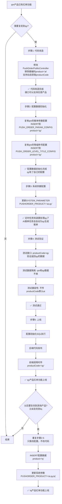

# 红单功能 qm → qy 复刻技术方案

**版本：** v1.0  
**日期：** 2025-01-XX  
**状态：** 待实施

---

## 📋 执行路径清单

> **⚠️ 重要：** 请按照 [执行路径清单](./qm-to-qy-redbill-execution-checklist.md) 逐项执行，确保100%覆盖！

**执行清单包含：**

### 🔴 必须完成（需要改造）
1. ✅ 配置初始化（SQL脚本）- 2个表，2条SQL
2. ✅ 系统参数配置 - 1个参数，1条SQL
3. ✅ 代码改造（PushOrderPublicController）- 1个文件，7个接口，移除硬编码

### 🟡 建议完成（需确认或验证）
4. ⚠️ 代码确认（PushOrderInsideController）- 1处逻辑，需确认VIP限制
5. ❌ 代码验证（PushOrderExternalController）- 18个接口，已支持多产品，只需验证
6. ⚠️ 废弃接口检查 - 1个接口，确认是否使用
7. ❌ 后台管理接口验证 - 5个Controller，已支持多产品，只需验证
8. ❌ 定时任务验证 - 2个任务，已支持多产品，只需验证
9. ❌ 数据库表检查 - 7个表，确认有product字段
10. ❌ DAO层SQL检查 - 6个DAO文件，确认按product过滤
11. ❌ 后台管理界面检查 - 5个页面，验证支持qy

### 🟢 可选完成（可选验证）
12. ❌ 三方接口调用检查 - 确认外部系统调用情况

**图例：**
- ✅ 需要改造
- ⚠️ 需确认
- ❌ 不需要改造（只需验证）

**详细执行步骤请查看：** [qm-to-qy-redbill-execution-checklist.md](./qm-to-qy-redbill-execution-checklist.md)

---

## 📊 业务流程图（秒懂版）



---

## 🎯 为什么这么设计？（核心原理）

### 现状：qm 产品已有完整红单功能

```
qm产品 (product='at')
├── 18个App接口 ✅ 已支持多产品（从header获取product）
├── 7个对外接口 ❌ 硬编码product='at'（只支持qm）
├── 配置数据（推单参数、等级称号）
├── 定时任务（AI推单、红单结算）
└── 数据库表（都有product字段，数据隔离）
```

### 目标：让 qy 产品也能用同样的功能

```
qy产品 (product='qy')
├── 18个App接口 ✅ 直接可用（传product='qy'）
├── 7个对外接口 ❌ 需要改造（移除硬编码）
├── 配置数据 ❌ 需要初始化（复制qm的配置）
├── 定时任务 ✅ 自动支持（系统参数加qy）
└── 数据库表 ✅ 已有product字段（数据隔离）
```

### 设计原理：**一套代码，多产品数据隔离**

```
┌─────────────────────────────────────────┐
│         同一套代码（Controller/Service）  │
│                                          │
│  PushOrderExternalController             │
│  PushOrderPublicController ← 需要改造    │
│  MasterUserService                       │
│  AIPushOrderTask（定时任务）              │
└─────────────────────────────────────────┘
              ↓ 通过product参数
┌─────────────────────────────────────────┐
│         同一套数据库表                   │
│                                          │
│  PUSH_ORDER_CONTENT_MANAGEMENT          │
│  ├── product='at' → qm的数据            │
│  └── product='qy' → qy的数据            │
│                                          │
│  PUSH_ORDER_PARAM_CONFIG                │
│  ├── product='at' → qm的配置            │
│  └── product='qy' → qy的配置（需初始化）│
└─────────────────────────────────────────┘
```

---

## 📋 详细实施步骤

### 步骤1：代码改造（为什么先改代码？）

**目的：** 让接口支持动态获取产品代码，而不是硬编码

**操作：**
1. 修改 `PushOrderPublicController.java`
2. 删除硬编码 `product = "at"`
3. 添加 `getProductCode()` 方法
4. 7个接口方法都改为动态获取 product

**为什么先改代码？**
- ✅ 代码改好后，接口就能支持任意产品了
- ✅ 后续复刻其他产品时，代码不需要再改
- ✅ 这是**一次性的基础工作**

**时间：** 1天

---

### 步骤2：配置数据初始化（为什么需要？）

**目的：** qy 产品需要自己的配置数据（推单参数、等级称号等）

**操作：**
```sql
-- 复制qm的推单参数配置到qy
INSERT INTO PUSH_ORDER_PARAM_CONFIG (..., product, ...)
SELECT ..., 'qy', ... FROM PUSH_ORDER_PARAM_CONFIG WHERE product='at';

-- 复制qm的等级称号配置到qy
INSERT INTO PUSH_ORDER_LEVEL_TITLE_CONFIG (..., product, ...)
SELECT ..., 'qy', ... FROM PUSH_ORDER_LEVEL_TITLE_CONFIG WHERE product='at';
```

**为什么需要？**
- ❓ qy 和 qm 可能有不同的推单价格、等级要求等
- ✅ 即使配置相同，也需要独立的数据记录（便于后续独立调整）
- ✅ 数据隔离：qm 改配置不影响 qy

**时间：** 0.5天

---

### 步骤3：系统参数配置（为什么需要？）

**目的：** 让定时任务知道要处理 qy 产品

**操作：**
```sql
-- 更新系统参数，添加qy
UPDATE SYSTEM_PARAMETER 
SET value = 'at,qy'
WHERE category = 'PUSHORDER' AND code = 'PUSHORDER_PRODUCT';
```

**为什么需要？**
- ✅ AI推单任务会读取这个参数，知道要为哪些产品生成推单
- ✅ 加上 qy 后，定时任务会自动为 qy 生成推单
- ✅ 不需要改定时任务代码

**时间：** 5分钟

---

### 步骤4：测试验证

**测试点：**
1. ✅ 接口测试：传 `productCode='qy'`，返回 qy 的数据
2. ✅ 数据隔离：qm 的数据不会出现在 qy 的查询结果中
3. ✅ 兼容性：不传 `productCode` 时默认 `at`（qm）

**时间：** 1-2天

---

### 步骤5：上线

**发布顺序：**
1. 配置初始化 SQL 执行
2. 后端代码发布
3. 前端调用时传 `productCode='qy'`

**时间：** 0.5天

---

## 🔄 以后复刻其他产品怎么办？（比如复刻到 tq）

### 方案：**只需重复步骤2-5，代码不需要再改**

```
复刻到tq产品流程：
┌─────────────────────────────────────┐
│ 步骤1: 代码改造 ❌ 不需要（已支持）   │
└─────────────────────────────────────┘
              ↓
┌─────────────────────────────────────┐
│ 步骤2: 配置初始化 ✅ 需要            │
│ INSERT配置数据 product='tq'         │
└─────────────────────────────────────┘
              ↓
┌─────────────────────────────────────┐
│ 步骤3: 系统参数配置 ✅ 需要          │
│ PUSHORDER_PRODUCT='at,qy,tq'        │
└─────────────────────────────────────┘
              ↓
┌─────────────────────────────────────┐
│ 步骤4: 测试验证 ✅ 需要             │
│ 测试productCode='tq'                │
└─────────────────────────────────────┘
              ↓
┌─────────────────────────────────────┐
│ 步骤5: 上线 ✅ 需要                 │
└─────────────────────────────────────┘
```

**核心优势：**
- ✅ **代码一次改造，永久复用**
- ✅ 后续复刻只需改配置，不改代码
- ✅ 每个产品独立配置，互不影响

---

## 📊 修改点总览

| 修改类型 | 文件/位置 | 说明 | 优先级 | 是否一次性 |
|---------|----------|------|--------|-----------|
| **代码改造** | `PushOrderPublicController.java` | 移除硬编码 product="at" | 🔴 必须 | ✅ 一次性 |
| **代码确认** | `PushOrderInsideController.java` | 确认VIP限制逻辑（第90行） | 🟡 建议 | ✅ 一次性 |
| **配置初始化** | `PUSH_ORDER_PARAM_CONFIG` | 为 qy 初始化推单参数配置 | 🔴 必须 | ❌ 每个产品都要 |
| **配置初始化** | `PUSH_ORDER_LEVEL_TITLE_CONFIG` | 为 qy 初始化等级称号配置 | 🔴 必须 | ❌ 每个产品都要 |
| **系统参数** | `SYSTEM_PARAMETER` | 添加 qy 到 PUSHORDER_PRODUCT | 🔴 必须 | ❌ 每个产品都要 |

---

## 🔍 详细修改点

### 2.1 代码改造：PushOrderPublicController

**文件：** `DC-API-2018/dc-api/dc-api-office/src/main/java/com/dc/it/friend/controller/PushOrderPublicController.java`

**问题：** 第40行硬编码 `private String product = "at"`，导致所有接口只支持 qm（at）产品

**修改方案：**

1. **删除硬编码：**
```java
// 删除这行
private String product = "at";//对外的就查AT的
```

2. **添加获取产品代码方法：**
```java
/**
 * 获取产品代码
 * 优先级：请求参数 productCode > header productCode > 默认值 "at"（兼容老调用）
 */
private String getProductCode(HttpServletRequest request, Map<String, Object> map) {
    // 1. 优先从请求参数获取
    if (map != null && map.containsKey("productCode")) {
        String productCode = String.valueOf(map.get("productCode"));
        if (StringUtils.isNotBlank(productCode) && !"null".equals(productCode)) {
            return productCode;
        }
    }
    
    // 2. 从 header 获取
    String headerProduct = request.getHeader("productCode");
    if (StringUtils.isNotBlank(headerProduct)) {
        return headerProduct;
    }
    
    // 3. 默认值（向后兼容）
    return "at";
}
```

3. **修改所有7个接口方法：**
将所有 `map.put("product", product)` 改为 `map.put("product", getProductCode(request, map))`

**涉及的方法：**
- `findPersonalInfoPageList()` - 第81行
- `findMasterDetailed()` - 第100行
- `findBaseUserInfo()` - 第120行
- `findMonthlyRankingPageList()` - 第138行
- `findPlanDetailed()` - 第156行
- `findProgrammePreferredPageList()` - 第175行
- `findMatchPreferredPageList()` - 第193行

**兼容性：** 不传 `productCode` 时默认使用 `"at"`，保持向后兼容

---

### 2.2 配置数据初始化

#### 2.2.1 PUSH_ORDER_PARAM_CONFIG（推单参数配置）

**SQL 脚本：**
```sql
-- 从 qm（at）复制配置到 qy
INSERT INTO PUSH_ORDER_PARAM_CONFIG (
    id, real_name_is, user_level, level_name, deposit, bet_amount,
    registration_day, number_fans, daily_push_limit, push_orders_price,
    fan_bonus, push_order_bonus, purchase_bonus, click_count_bonus,
    consumption_amount, number_buy, free_times, operator, product, operator_time, type
)
SELECT 
    SEQ_PUSH_ORDER_PARAM_CONFIG.NEXTVAL,
    real_name_is, user_level, level_name, deposit, bet_amount,
    registration_day, number_fans, daily_push_limit, push_orders_price,
    fan_bonus, push_order_bonus, purchase_bonus, click_count_bonus,
    consumption_amount, number_buy, free_times, 
    'system', 'qy', SYSDATE, type
FROM PUSH_ORDER_PARAM_CONFIG
WHERE product = 'at';
```

#### 2.2.2 PUSH_ORDER_LEVEL_TITLE_CONFIG（推单等级称号配置）

**SQL 脚本：**
```sql
-- 从 qm（at）复制等级称号配置到 qy
INSERT INTO PUSH_ORDER_LEVEL_TITLE_CONFIG (
    id, name, number_tweets, number_tweets_football, number_tweets_basketball,
    mall_points, red_order_rate, number_red, number_fans, popularity_value,
    total_deposit, total_bet, sort, type, product, operator, operator_time, del
)
SELECT 
    SEQ_PUSH_ORDER_LEVEL_TITLE_CONFIG.NEXTVAL,
    name, number_tweets, number_tweets_football, number_tweets_basketball,
    mall_points, red_order_rate, number_red, number_fans, popularity_value,
    total_deposit, total_bet, sort, type, 
    'qy', 'system', SYSDATE, '0'
FROM PUSH_ORDER_LEVEL_TITLE_CONFIG
WHERE product = 'at' AND del = '0';
```

#### 2.2.3 SYSTEM_PARAMETER（系统参数）

**需要添加/修改的参数：**

```sql
-- 检查是否存在 PUSHORDER_PRODUCT 参数
SELECT * FROM SYSTEM_PARAMETER 
WHERE category = 'PUSHORDER' AND code = 'PUSHORDER_PRODUCT';

-- 如果存在，更新值（添加 qy）
UPDATE SYSTEM_PARAMETER 
SET value = 'at,qy'  -- 或 'at,qy' 根据实际情况
WHERE category = 'PUSHORDER' AND code = 'PUSHORDER_PRODUCT';

-- 如果不存在，插入新记录（需要确认表结构和序列）
-- INSERT INTO SYSTEM_PARAMETER (...) VALUES (...);
```

**说明：** 定时任务 `AIPushOrderTask` 通过这个系统参数获取需要生成推单的产品列表，加上 `qy` 后，定时任务会自动为 qy 生成推单。

---

### 2.3 PushOrderInsideController 确认点（需要确认）

**文件：** `DC-API-2018/dc-api/dc-api-friend/src/main/java/com/dc/it/controller/PushOrderInsideContoller.java`

**状态：** ✅ 已支持多产品（从header获取product），无需改造

**需要确认的点：**

#### 2.3.1 VIP购买限制逻辑（第90行）

**当前代码：**
```java
//球盟需求 VIP1以上的才可以购买
if ("at".equalsIgnoreCase(product)){
    int userLevel=Integer.parseInt((String)map.get("userLevel"));
    if (userLevel<1){
        return resultMap(ErrorCode.SC_20000.getCode(),"VIP1以上才可以购买",null);
    }
}
```

**问题：** qm（at）产品要求VIP1以上才能购买，qy产品是否也需要这个限制？

**选项：**
1. **qy也需要VIP限制** → 修改为：`if ("at".equalsIgnoreCase(product) || "qy".equalsIgnoreCase(product))`
2. **qy不需要VIP限制** → 保持现状，qy产品不检查VIP等级
3. **qy有不同限制** → 需要确认qy的VIP要求

**建议：** 与产品/业务确认qy产品的购买权限要求

---

### 2.4 代码检查点（可选）

#### 2.4.1 红单结算任务

**文件：** `DC-API-2018/dc-api/dc-api-sportcron/src/main/resources/mapper/ob/OBEventDao.xml`

**问题：** `queryObMatchDataList` SQL（第41-73行）查询待结算红单时，**没有按 product 过滤**

**当前 SQL：**
```xml
<select id="queryObMatchDataList" resultType="java.util.Map">
    select ... from PUSH_ORDER_CONTENT_MANAGEMENT 
    where STATE = '2' and COMPETITION_RESULTS = '0' 
    and (WIN_ALONE_HANDICAP_ID is not null or ...)
    <!-- 缺少：and product = ? -->
</select>
```

**影响分析：**
- ✅ **不影响功能：** 更新时通过 `id` 更新，不会串数据
- ⚠️ **性能问题：** 会查询所有产品的待结算红单，数据量大时可能影响性能
- ✅ **连红计算正常：** `queryObMatchSumLianHong` 已按 product 过滤

**建议：** 
- 如果 qm 和 qy 数据量不大，可以不改
- 如果数据量大，建议加上 product 过滤，但需要修改任务逻辑（循环处理各产品）

---

## 三、涉及的表结构（无需修改）

| 表名 | 说明 | product字段 | 状态 |
|------|------|-------------|------|
| `PUSH_ORDER_CONTENT_MANAGEMENT` | 推单内容管理 | ✅ 有 | 无需修改 |
| `PUSH_ORDER_CONTENT_GENERAL_LOG` | 推单综合日志 | ✅ 有 | 无需修改 |
| `F_USER` | 用户表 | ✅ 有 | 无需修改 |
| `PUSH_ORDER_PARAM_CONFIG` | 推单参数配置 | ✅ 有 | 需初始化数据 |
| `PUSH_ORDER_LEVEL_TITLE_CONFIG` | 推单等级称号配置 | ✅ 有 | 需初始化数据 |
| `SYSTEM_PARAMETER` | 系统参数表 | ⚠️ 需确认 | 需添加/更新参数 |

---

## 四、接口清单（秒懂版）

### 📋 两种接口的区别（一目了然）

| 对比项 | 18个App接口 | 7个对外接口 |
|--------|------------|------------|
| **Controller** | `PushOrderExternalController` | `PushOrderPublicController` |
| **路径** | `/api/friend/pushOrder/external/1.0/` | `/api/public/pushOrder/` |
| **是否需要登录** | ✅ 需要（从header获取userName） | ❌ 不需要（无需登录） |
| **调用方** | App客户端（用户登录后使用） | 外部系统/第三方平台 |
| **主要功能** | 浏览、购买、发布、管理推单 | 只读展示（浏览红单数据） |
| **涉及用户操作** | ✅ 有（购买、发布、关注等） | ❌ 无（纯展示） |
| **当前状态** | ✅ 已支持多产品 | ❌ 硬编码product="at" |
| **是否需要改造** | ❌ 不需要 | ✅ 需要 |

**简单理解：**
- **18个App接口** = 给**自己App用户**用的，需要登录，功能完整（买、卖、看）
- **4个内部接口** = 给**系统内部WebService**用的，内部验证，处理核心业务（购买、权限）
- **7个对外接口** = 给**外部系统**用的，无需登录，只能看（只读）

---

### 4.1 18个App客户端接口（无需修改）

**Controller：** `PushOrderExternalController`  
**路径：** `/api/friend/pushOrder/external/1.0/`  
**特点：** ✅ 需要登录（从header获取userName和product）  
**用途：** 给App客户端用的，用户登录后使用  
**状态：** ✅ 已支持多产品，无需修改

**功能分类：**

#### 📊 浏览查看类（8个）
1. `findPersonalInfoPageList` - 大师列表（篮球/足球大师）
2. `findMonthlyRankingFirstList` - 首页月榜（前3名）
3. `findMonthlyRankingPageList` - 月榜列表（红单榜/连红榜/人气榜）
4. `findMyAttentionPageList` - 我的关注列表
5. `findMatchPreferredPageList` - 赛事优选列表
6. `findMatchPreferredProgrammePageList` - 赛事优选方案列表
7. `findProgrammePreferredPageList` - 方案优选列表
8. `findPlanDetailed` - 方案详细

#### 💰 购买相关类（2个）
9. `findMyPurchasePageList` - 我的购买列表
10. `pushOrderClickReceive` - 推单点击统计（点击推单时调用）

#### 👤 专家相关类（2个）
11. `findMasterDetailed` - 大师详细（专家详情页）
12. `findProgrammePreferredEntity` - 方案优选实体（APP版，返回1个）
13. `findProgrammePreferredEntity` (v1.1) - 方案优选实体（PC版，返回3个）

#### ✍️ 发布管理类（3个）
14. `releasePushOrderContent` - 发布推单内容（专家发布推单）
15. `findMyPushOrderRecord` - 我的推单记录列表
16. `findMyPushOrderRecordDetailed` - 我的推单记录详细

#### 🎯 专题查询类（2个）
17. `findPushOrderEventUEDSpecialSubject` - UED专题查询
18. `findPushOrderFiveEvent` - 5大赛事查询

**解决什么问题？**
- ✅ App用户登录后，可以浏览红单、关注专家、购买方案、发布推单等
- ✅ 所有功能都需要用户身份（userName），所以需要登录

---

### 4.2 4个内部WebService接口（需要确认）

**Controller：** `PushOrderInsideController`  
**路径：** `/api/friend/pushOrder/inside/1.0/`  
**特点：** ✅ 内部验证（`insideVerification`），WebService调用  
**用途：** 给系统内部WebService调用的，处理购买、权限等核心业务  
**状态：** ✅ 已支持多产品，但**有qm特殊逻辑需要确认**

**接口列表：**

1. `findPurchasePushOrderInfo` - 获取购买推单信息
   - **用途：** WebService获取购买推单的详细信息
   - **状态：** ✅ 已支持多产品

2. `purchasePlanReceive` - 购买推单
   - **用途：** WebService执行购买推单操作
   - **问题：** ⚠️ 第90行硬编码 `if ("at".equalsIgnoreCase(product))`，qm产品要求VIP1以上才能购买
   - **需要确认：** qy产品是否也需要VIP限制？还是不需要？

3. `pushOrderAdvancementLogin` - 推单晋级（登录后调用）
   - **用途：** 用户登录后检查是否可以晋级
   - **状态：** ✅ 已支持多产品

4. `findPushOrderPermissionInfo` - 推单权限信息认证
   - **用途：** 进入推单页面时检查用户权限
   - **状态：** ✅ 已支持多产品

**解决什么问题？**
- ✅ 系统内部WebService调用，处理购买、权限等核心业务逻辑
- ✅ 通过 `insideVerification` 验证，确保是系统内部调用（不是外部调用）

**是否需要改造？**
- ✅ **大部分不需要改造**：已支持多产品（从header获取product）
- ⚠️ **需要确认：** `purchasePlanReceive` 接口第90行的VIP限制逻辑
  - qm（at）产品：VIP1以上才能购买
  - qy产品：是否需要同样的限制？还是不需要？

---

### 4.3 7个对外系统接口（需要修改）

**Controller：** `PushOrderPublicController`  
**路径：** `/api/public/pushOrder/`  
**特点：** ❌ 无需登录（给外部系统调用）  
**状态：** ❌ 硬编码 `product="at"`，需要改造

---

#### 🔍 关键问题：这7个接口和18个App接口是什么关系？

**答案：有6个接口是重复的，但调用方式不同！**

| 对外接口 | App接口 | 关系 | 区别 |
|---------|---------|------|------|
| `findPersonalInfoPageList` | ✅ 有同名接口 | **重复** | App需要登录，对外无需登录 |
| `findMasterDetailed` | ✅ 有同名接口 | **重复** | App调用`findMasterDetailed`，对外调用`findMasterDetailed2` |
| `findMonthlyRankingPageList` | ✅ 有同名接口 | **重复** | App需要登录，对外无需登录 |
| `findPlanDetailed` | ✅ 有同名接口 | **重复** | App调用`findPlanDetailed`，对外调用`findPlanDetailed2` |
| `findProgrammePreferredPageList` | ✅ 有同名接口 | **重复** | App调用`findProgrammePreferredPageList`，对外调用`findProgrammePreferredPageList2` |
| `findMatchPreferredPageList` | ✅ 有同名接口 | **重复** | App调用`findMatchPreferredPageList`，对外调用`findMatchPreferredPageList2` |
| `findPushUserInfo` | ❌ 没有 | **独有** | 只有对外接口有 |

**结论：**
- ✅ **6个接口功能重复**，但App接口需要登录，对外接口无需登录
- ✅ **1个接口是独有的**（`findPushUserInfo`）

---

#### 💡 为什么要有这7个对外接口？（解决什么问题？）

**场景1：第三方网站要展示红单数据**
```
第三方网站（比如合作伙伴的网站）
  ↓
调用 /api/public/pushOrder/findPersonalInfoPageList
  ↓
无需登录，直接展示红单专家列表
  ↓
用户点击后，跳转到你们的App购买
```

**场景2：嵌入到其他系统**
```
其他系统（比如H5页面、小程序）
  ↓
调用 /api/public/pushOrder/findPlanDetailed
  ↓
无需登录，直接展示推单方案详情
  ↓
展示给未登录用户看，吸引他们注册/下载App
```

**场景3：数据对接/API开放**
```
合作伙伴需要红单数据
  ↓
调用对外接口获取公开数据
  ↓
无需用户登录，降低对接成本
```

**核心区别：**

| 对比项 | App接口 | 对外接口 |
|--------|---------|----------|
| **调用方** | 自己的App客户端 | 外部系统/第三方平台 |
| **是否需要登录** | ✅ 必须登录 | ❌ 无需登录 |
| **返回数据** | 包含用户相关信息（是否关注、是否购买等） | 只返回公开数据（不包含用户信息） |
| **使用场景** | App内用户使用 | 外部系统展示、数据对接 |
| **安全性** | 高（需要用户身份） | 低（公开数据） |

**简单理解：**
- **App接口** = 给**自己App用户**用的，需要登录，能看到个性化数据（比如"我是否关注了这个专家"）
- **对外接口** = 给**外部系统**用的，无需登录，只能看到公开数据（比如"这个专家有多少粉丝"）

---

#### 📋 7个对外接口详细说明

1. **`findPersonalInfoPageList`** - 大师列表
   - **App接口有吗？** ✅ 有（同名）
   - **用途：** 外部系统展示篮球/足球大师列表
   - **场景：** 第三方网站要展示红单专家，无需登录

2. **`findMasterDetailed`** - 大师详细
   - **App接口有吗？** ✅ 有（同名，但调用方法不同）
   - **用途：** 外部系统展示专家详情
   - **场景：** 点击专家后查看详细信息，无需登录

3. **`findPushUserInfo`** - 推单用户基本信息
   - **App接口有吗？** ❌ **没有，这是独有的**
   - **用途：** 获取推单用户的基本信息列表
   - **场景：** 外部系统需要展示用户列表

4. **`findMonthlyRankingPageList`** - 排行榜
   - **App接口有吗？** ✅ 有（同名）
   - **用途：** 外部系统展示排行榜（红单榜/连红榜/人气榜）
   - **场景：** 第三方网站要展示红单排行榜，无需登录

5. **`findPlanDetailed`** - 方案详情
   - **App接口有吗？** ✅ 有（同名，但调用方法不同）
   - **用途：** 外部系统展示推单方案详情
   - **场景：** 点击方案后查看详细内容，无需登录

6. **`findProgrammePreferredPageList`** - 方案优先方案列表
   - **App接口有吗？** ✅ 有（同名，但调用方法不同）
   - **用途：** 外部系统展示方案优选列表
   - **场景：** 第三方网站要展示热门推单方案，无需登录

7. **`findMatchPreferredPageList`** - 赛事优选列表
   - **App接口有吗？** ✅ 有（同名，但调用方法不同）
   - **用途：** 外部系统展示赛事优选列表
   - **场景：** 第三方网站要展示热门赛事，无需登录

---

#### ❓ 为什么需要改造？

**问题：** 目前硬编码 `product="at"`，外部系统只能看到 qm 的数据

**改造后：** 外部系统传 `productCode="qy"` 就能看到 qy 的数据

**举例：**
```
改造前：
第三方网站调用 → 只能看到 qm 的红单数据

改造后：
第三方网站调用（传productCode='qy'） → 能看到 qy 的红单数据
第三方网站调用（不传productCode） → 默认看到 qm 的红单数据（兼容）
```

---

## 五、定时任务（无需修改代码）

### 5.1 AI推单任务

**类：** `AIPushOrderTask`  
**模块：** `dc-api-office`

**任务列表：**
- `aiPushOrder()` - 每天21点执行
- `aiRepairPushOrder()` - 每天23点执行
- `aiRestockPushOrder()` - 每天0点1秒执行
- `userFire()` - 每月5号0点执行
- `aiRealPushOrder()` - 每天20点执行

**状态：** ✅ 已支持多产品，通过系统参数 `PUSHORDER_PRODUCT` 配置产品列表

**操作：** 只需在系统参数中添加 `qy`，无需修改代码

### 5.2 红单结算任务

**类：** `OBEventServiceImpl.queryObMatchDataList()`  
**模块：** `dc-api-sportcron`

**状态：** ⚠️ SQL 未按 product 过滤，但不影响功能（见 2.3.1）

---

## 六、风险点

1. **数据隔离风险：** product 字段漏传导致数据串库
   - **应对：** DAO 层所有 SQL 已强制要求 product 参数

2. **兼容性风险：** 老调用方不传 productCode
   - **应对：** 默认值设为 "at"，保持向后兼容

3. **配置缺失风险：** qy 配置未初始化
   - **应对：** 配置初始化脚本必须执行

---

## 七、测试用例

### 7.1 接口测试
```
POST /api/public/pushOrder/findPersonalInfoPageList
Body: {"productCode": "qy", "pageNum": 1, "pageSize": 10, "name": "足球大师"}

预期：返回 qy 产品数据，不包含 qm 数据
```

### 7.2 兼容性测试
```
POST /api/public/pushOrder/findPersonalInfoPageList
Body: {"pageNum": 1, "pageSize": 10, "name": "足球大师"}
（不传 productCode）

预期：默认使用 "at"，返回 qm 数据
```

---

**文档状态：** 待实施  
**下一步：** 开始代码改造
