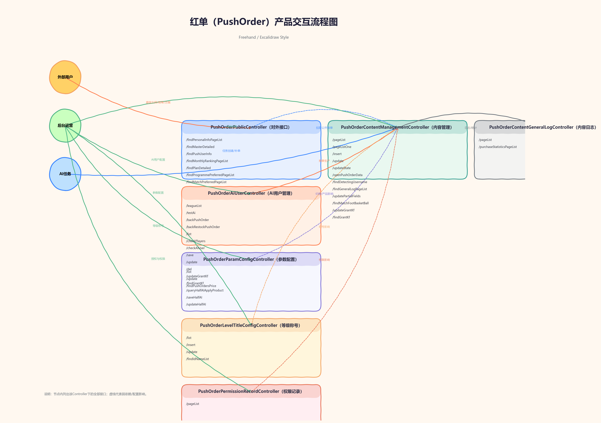

# 红单产品交互文档

> 基于抓包记录 + 后端代码整理，覆盖红单外部接口、内部接口、公共接口的请求/响应字段说明

**接口分类**：
- **外部接口（External）**：需要登录，路径 `/api/friend/pushOrder/external/1.0/`，共11个
- **内部接口（Inside）**：WebService调用，路径 `/api/friend/pushOrder/inside/1.0/`，共4个
- **公共接口（Public）**：无需登录，路径 `/api/public/pushOrder/`，共7个

---

## 架构总览



---

## 接口规范

| 项目 | 说明 |
|------|------|
| 请求方式 | POST |
| Content-Type | application/json;charset=UTF-8 |
| 成功响应码 | code = "10000" |
| 业务错误码 | code = "10001" |

**通用响应结构**
```json
{
  "code": "10000",
  "data": {},
  "message": "系统成功"
}
```

**分页数据结构（适用于 pageList 接口）**
```json
{
  "pageNum": 1,
  "pageSize": 20,
  "total": 100,
  "pages": 5,
  "list": []
}
```

---

## 1. 榜单/大师模块

### 1.1 findProgrammePreferredEntity - 偏好方案实体（首页推荐一条）

**接口**: `POST /api/friend/pushOrder/external/1.0/findProgrammePreferredEntity`

**请求参数**：无需参数（仅依赖登录态）

**响应示例**:
```json
{
  "code": "10000",
  "data": {
    "id": 123456,
    "redOrderRate": "75",
    "homeTeamName": "利物浦",
    "awayTeamName": "切尔西",
    "homeLogoUrl": "https://example.com/home.png",
    "awayLogoUrl": "https://example.com/away.png",
    "matchType": "0",
    "matchTime": "01-30 20:00",
    "eventStatus": "0",
    "title": "英超焦点战",
    "createTime": "01-30 12:30",
    "leagueName": "英超",
    "lianHong": 3,
    "nickName": "大师A",
    "headUrl": "https://example.com/avatar.png",
    "levelConfigIdName": "黄金大师",
    "authentication": "0",
    "fireIcon": "0"
  },
  "message": "系统成功"
}
```

**data 字段说明**:
| 字段 | 类型 | 说明 |
|------|------|------|
| id | Long | 推单ID |
| redOrderRate | String | 红单率（整数百分比） |
| homeTeamName | String | 主队名称 |
| awayTeamName | String | 客队名称 |
| homeLogoUrl | String | 主队图标 |
| awayLogoUrl | String | 客队图标 |
| matchType | String | 赛事类型：0=足球，1=篮球 |
| matchTime | String | 比赛时间（格式化） |
| eventStatus | String | 赛事状态：0=未开始，1=进行中 |
| title | String | 推单标题 |
| createTime | String | 推单发布时间（格式化） |
| leagueName | String | 联赛名称 |
| lianHong | Long | 连红数 |
| nickName | String | 大师昵称 |
| headUrl | String | 头像 |
| levelConfigIdName | String | 等级称号 |
| authentication | String | V认证：0=是，1=否 |
| fireIcon | String | 火标：0=是，1=否 |

---

### 1.2 findMonthlyRankingPageList - 月榜分页

**接口**: `POST /api/friend/pushOrder/external/1.0/findMonthlyRankingPageList`

**请求参数**:
```json
{
  "pageNum": 1,
  "pageSize": 20,
  "operationType": 0
}
```

| 参数 | 类型 | 必填 | 说明 |
|------|------|------|------|
| pageNum | Number | 是 | 页码（从1开始） |
| pageSize | Number | 是 | 每页条数 |
| operationType | Number | 否 | 榜单类型：0=红单榜（默认），1=连红榜，2=人气榜 |

**响应示例**:
```json
{
  "code": "10000",
  "data": {
    "pageNum": 1,
    "pageSize": 20,
    "total": 200,
    "pages": 10,
    "list": [
      {
        "indexType": "0",
        "id": 100001,
        "nickName": "大师A",
        "headUrl": "https://example.com/a.png",
        "levelConfigIdName": "黄金大师",
        "authentication": "0",
        "fireIcon": "0",
        "saleOfNum": "12",
        "redOrderRate": 68,
        "follow": 0
      }
    ]
  },
  "message": "系统成功"
}
```

**list 字段说明**（根据 operationType 返回不同核心字段）:
| 字段 | 类型 | 说明 |
|------|------|------|
| indexType | String | 0=头部推荐，1=普通 |
| id | Long | 用户ID |
| nickName | String | 昵称 |
| headUrl | String | 头像 |
| levelConfigIdName | String | 等级称号 |
| authentication | String | V认证：0=是，1=否 |
| fireIcon | String | 火标：0=是，1=否 |
| saleOfNum | String | 在售单数 |
| follow | Integer | 关注状态：0=未关注，1=已关注，2=本人 |
| redOrderRate | Number | 红单榜字段（operationType=0）|
| lianHong | Long | 连红榜字段（operationType=1）|
| totalPopularity | String | 人气榜字段（operationType=2）|

---

### 1.3 findPersonalInfoPageList - 大师列表

**接口**: `POST /api/friend/pushOrder/external/1.0/findPersonalInfoPageList`

**请求参数**:
```json
{
  "pageNum": 1,
  "pageSize": 20,
  "name": "篮球大师"
}
```

| 参数 | 类型 | 必填 | 说明 |
|------|------|------|------|
| pageNum | Number | 是 | 页码 |
| pageSize | Number | 是 | 每页条数 |
| name | String | 是 | 称号名称（如：篮球大师、足球大师） |

**响应示例**:
```json
{
  "code": "10000",
  "data": {
    "pageNum": 1,
    "pageSize": 20,
    "total": 80,
    "pages": 4,
    "list": [
      {
        "id": 100001,
        "nickName": "大师A",
        "headUrl": "https://example.com/a.png",
        "levelConfigIdName": "黄金大师",
        "authentication": "0",
        "fireIcon": "0",
        "saleOfNum": "6",
        "follow": 0,
        "totalPopularity": "120"
      }
    ]
  },
  "message": "系统成功"
}
```

**list 字段说明**:
| 字段 | 类型 | 说明 |
|------|------|------|
| id | Long | 用户ID |
| nickName | String | 昵称 |
| headUrl | String | 头像 |
| levelConfigIdName | String | 等级称号 |
| authentication | String | V认证：0=是，1=否 |
| fireIcon | String | 火标：0=是，1=否 |
| saleOfNum | String | 在售单数 |
| follow | Integer | 关注状态：0=未关注，1=已关注，2=本人 |
| totalPopularity | String | 人气值 |

---

### 1.4 findMonthlyRankingFirstList - 首页月榜

**接口**: `POST /api/friend/pushOrder/external/1.0/findMonthlyRankingFirstList`

**请求参数**: `{}`

**响应示例**:
```json
{
  "code": "10000",
  "data": {
    "redOrderRateList": ["https://example.com/a.png", "https://example.com/b.png"],
    "lianHongList": ["https://example.com/c.png"],
    "totalPopularityList": ["https://example.com/d.png"]
  },
  "message": "系统成功"
}
```

| 字段 | 类型 | 说明 |
|------|------|------|
| redOrderRateList | List<String> | 红单榜头部头像列表 |
| lianHongList | List<String> | 连红榜头部头像列表 |
| totalPopularityList | List<String> | 人气榜头部头像列表 |

---

### 1.5 findMasterDetailed - 大师详情

**接口**: `POST /api/friend/pushOrder/external/1.0/findMasterDetailed`

**请求参数**:
```json
{
  "id": 100001,
  "operationMode": 0,
  "pageNum": 1,
  "pageSize": 20,
  "matchType": "0",
  "matchTypeOne": "2"
}
```

| 参数 | 类型 | 必填 | 说明 |
|------|------|------|------|
| id | Long | 是 | 大师用户ID |
| operationMode | String/Number | 是 | 0=首次进入，1=分页查询推单信息 |
| pageNum | Number | 是 | 页码 |
| pageSize | Number | 是 | 每页条数 |
| matchType | String | 否 | 赛事类型：0=足球，1=篮球 |
| matchTypeOne | String | 否 | 查询范围：0=近7天，1=近30天，2=全部 |

**响应示例**:
```json
{
  "code": "10000",
  "data": {
    "pushOrders": "0",
    "userId": 100001,
    "nickName": "大师A",
    "headUrl": "https://example.com/a.png",
    "authentication": "0",
    "fireIcon": "0",
    "totalRelease": 52,
    "levelConfigIdName": "黄金大师",
    "followNum": 120,
    "fassNum": 890,
    "lianHong": 5,
    "maxLianHong": 8,
    "redOrderRate": "67",
    "profitRate": "12",
    "follow": 0,
    "competitionResultsList": ["1", "2", "1"],
    "titleConfigIdList": ["连红王", "稳健大师"],
    "pageInfo": {
      "pageNum": 1,
      "pageSize": 20,
      "total": 36,
      "pages": 2,
      "list": [
        {
          "id": 123456,
          "lianHong": 3,
          "homeTeamName": "利物浦",
          "awayTeamName": "切尔西",
          "matchType": "0",
          "matchId": 998877,
          "leagueId": 1122,
          "matchTime": "01-30 20:00",
          "eventStatus": "0",
          "whetherBuyer": 0,
          "title": "英超焦点战",
          "pushOrderContent": "看好主胜",
          "pushOrderOption": "全场独赢:主胜_100",
          "betItemsList": [
            {
              "one": "全场独赢",
              "two": "主胜",
              "three": "100",
              "four": "1.95",
              "five": "1",
              "handicapId": "0",
              "betItemsId": "0"
            }
          ],
          "price": 10,
          "createTime": "01-30 12:30",
          "leagueName": "英超",
          "numberClick": 120,
          "numberBuyer": 30,
          "numberFollowers": 20,
          "competitionResults": "0"
        }
      ]
    }
  },
  "message": "系统成功"
}
```

**data 字段说明（大师基础信息）**:
| 字段 | 类型 | 说明 |
|------|------|------|
| pushOrders | String | 是否推单：0=是，1=否（1时仅返回该字段） |
| userId | Long | 大师ID |
| nickName | String | 昵称 |
| headUrl | String | 头像 |
| authentication | String | V认证：0=是，1=否 |
| fireIcon | String | 火标：0=是，1=否 |
| totalRelease | Long | 总发布数 |
| levelConfigIdName | String | 等级称号 |
| followNum | Long | 关注数 |
| fassNum | Long | 粉丝数 |
| lianHong | Long | 连红数 |
| maxLianHong | Long | 最大连红 |
| redOrderRate | String | 红单率（整数百分比） |
| profitRate | String | 收益率（整数百分比） |
| follow | Integer | 关注状态：0=未关注，1=已关注，2=本人 |
| competitionResultsList | List<String> | 近10赛果（1红2黑3和） |
| titleConfigIdList | List<String> | 称号列表 |
| pageInfo | Object | 推单列表分页数据（同分页结构） |

**pageInfo.list 字段说明（推单列表项）**:
| 字段 | 类型 | 说明 |
|------|------|------|
| id | Long | 推单ID |
| lianHong | Long | 连红数 |
| homeTeamName | String | 主队名称 |
| awayTeamName | String | 客队名称 |
| matchType | String | 赛事类型：0=足球，1=篮球 |
| matchId | Long | 赛事ID |
| leagueId | Long | 联赛ID |
| matchTime | String | 比赛时间（格式化） |
| eventStatus | String | 赛事状态：0=未开始，1=进行中，2=结束 |
| whetherBuyer | Long | 是否购买：0=未购买，1=已购买，2=本人 |
| title | String | 推单标题 |
| pushOrderContent | String | 推单内容（购买或本人可见） |
| pushOrderOption | String | 推单选项（购买或本人可见） |
| betItemsList | List | 投注项明细 |
| price | Long | 售价 |
| createTime | String | 推单时间（格式化） |
| leagueName | String | 联赛名称 |
| numberClick | Long | 点击人数 |
| numberBuyer | Long | 购买人数 |
| numberFollowers | Long | 关注人数 |
| competitionResults | String | 赛果：0未结束1红2黑3和 |

---

### 1.6 findMyAttentionPageList - 我关注的推手

**接口**: `POST /api/friend/pushOrder/external/1.0/findMyAttentionPageList`

**请求参数**:
```json
{
  "pageNum": 1,
  "pageSize": 20
}
```

| 参数 | 类型 | 必填 | 说明 |
|------|------|------|------|
| pageNum | Number | 是 | 页码 |
| pageSize | Number | 是 | 每页条数 |

**响应示例**:
```json
{
  "code": "10000",
  "data": {
    "pageNum": 1,
    "pageSize": 20,
    "total": 3,
    "pages": 1,
    "list": [
      {
        "id": 100001,
        "nickName": "大师A",
        "headUrl": "https://example.com/a.png",
        "levelConfigIdName": "黄金大师",
        "authentication": "0",
        "fireIcon": "0",
        "saleOfNum": "6"
      }
    ]
  },
  "message": "系统成功"
}
```

**list 字段说明**:
| 字段 | 类型 | 说明 |
|------|------|------|
| id | Long | 用户ID |
| nickName | String | 昵称 |
| headUrl | String | 头像 |
| levelConfigIdName | String | 等级称号 |
| authentication | String | V认证：0=是，1=否 |
| fireIcon | String | 火标：0=是，1=否 |
| saleOfNum | String | 在售单数 |

---

## 2. 赛事优选模块

### 2.1 findMatchPreferredPageList - 偏好赛事分页

**接口**: `POST /api/friend/pushOrder/external/1.0/findMatchPreferredPageList`

**请求参数**:
```json
{
  "pageNum": 1,
  "pageSize": 20,
  "matchType": "0",
  "matchTypeOne": "0"
}
```

| 参数 | 类型 | 必填 | 说明 |
|------|------|------|------|
| pageNum | Number | 是 | 页码 |
| pageSize | Number | 是 | 每页条数 |
| matchType | String | 否 | 赛事类型：0=足球，1=篮球 |
| matchTypeOne | String | 否 | 0=热门赛事筛选（其余值不过滤） |

**响应示例**:
```json
{
  "code": "10000",
  "data": {
    "pageNum": 1,
    "pageSize": 20,
    "total": 5,
    "pages": 1,
    "list": [
      {
        "leagueName": "英超",
        "matchType": "0",
        "leagueId": 1122,
        "matchId": 998877,
        "homeTeamName": "利物浦",
        "awayTeamName": "切尔西",
        "matchTime": "今天  20:00",
        "homeLogoUrl": "https://example.com/home.png",
        "awayLogoUrl": "https://example.com/away.png",
        "pushOrdersNum": 6,
        "listHeadUrl": ["https://example.com/a.png", "https://example.com/b.png"],
        "isHot": "1"
      }
    ]
  },
  "message": "系统成功"
}
```

**list 字段说明**:
| 字段 | 类型 | 说明 |
|------|------|------|
| leagueName | String | 联赛名称 |
| matchType | String | 赛事类型：0=足球，1=篮球 |
| leagueId | Long | 联赛ID |
| matchId | Long | 赛事ID |
| homeTeamName | String | 主队名称 |
| awayTeamName | String | 客队名称 |
| matchTime | String | 比赛时间（格式化） |
| homeLogoUrl | String | 主队图标 |
| awayLogoUrl | String | 客队图标 |
| pushOrdersNum | Long | 推单数 |
| listHeadUrl | List<String> | 推单人员头像列表 |
| isHot | String | 是否热门赛事：0=否，1=是 |

---

## 3. 方案模块

### 3.1 findPlanDetailed - 方案详情

**接口**: `POST /api/friend/pushOrder/external/1.0/findPlanDetailed`

**请求参数**:
```json
{
  "id": 123456
}
```

| 参数 | 类型 | 必填 | 说明 |
|------|------|------|------|
| id | Long | 是 | 推单ID |

**响应示例**:
```json
{
  "code": "10000",
  "data": {
    "id": 123456,
    "title": "英超焦点战",
    "eventStatus": "0",
    "distanceTime": "3:15:40",
    "distanceTimeLong": 11740000,
    "createTimeOne": 1769755200000,
    "createTime": "01-30 12:30",
    "homeTeamName": "利物浦",
    "awayTeamName": "切尔西",
    "homeLogoUrl": "https://example.com/home.png",
    "awayLogoUrl": "https://example.com/away.png",
    "matchType": "0",
    "matchId": 998877,
    "leagueId": 1122,
    "matchTimeOne": 1769762400000,
    "matchTime": "01-30 20:00",
    "numberClick": 120,
    "numberBuyer": 30,
    "numberFollowers": 20,
    "nickName": "大师A",
    "headUrl": "https://example.com/a.png",
    "levelConfigIdName": "黄金大师",
    "authentication": "0",
    "userId": 100001,
    "fireIcon": "0",
    "follow": 0,
    "whetherBuyer": 0,
    "competitionResults": "0",
    "betItemsList": [
      {
        "one": "全场独赢",
        "two": "主胜",
        "three": "100",
        "four": "1.95",
        "competitionResults": "0"
      }
    ]
  },
  "message": "系统成功"
}
```

**data 字段说明**:
| 字段 | 类型 | 说明 |
|------|------|------|
| id | Long | 推单ID |
| title | String | 推单标题 |
| eventStatus | String | 赛事状态：0未开始1进行中2结束 |
| distanceTime | String | 距离开赛时间（仅 eventStatus=0） |
| distanceTimeLong | Long | 距离开赛毫秒（仅 eventStatus=0） |
| createTimeOne | Long | 推单时间戳 |
| createTime | String | 推单时间（格式化） |
| homeTeamName | String | 主队名称 |
| awayTeamName | String | 客队名称 |
| homeLogoUrl | String | 主队图标 |
| awayLogoUrl | String | 客队图标 |
| matchType | String | 赛事类型：0=足球，1=篮球 |
| matchId | Long | 赛事ID |
| leagueId | Long | 联赛ID |
| matchTimeOne | Long | 比赛时间戳 |
| matchTime | String | 比赛时间（格式化） |
| numberClick | Long | 点击人数 |
| numberBuyer | Long | 购买人数 |
| numberFollowers | Long | 关注人数 |
| nickName | String | 大师昵称 |
| headUrl | String | 头像 |
| levelConfigIdName | String | 等级称号 |
| authentication | String | V认证：0=是，1=否 |
| userId | Long | 大师用户ID |
| fireIcon | String | 火标：0=是，1=否 |
| follow | Integer | 关注状态：0未关注，1已关注，2本人 |
| whetherBuyer | Long | 是否购买：0未购买，1已购买，2本人 |
| competitionResults | String | 赛果：0未结束1红2黑3和 |
| betItemsList | List | 投注项明细 |

---

### 3.2 findProgrammePreferredPageList - 偏好方案分页

**接口**: `POST /api/friend/pushOrder/external/1.0/findProgrammePreferredPageList`

**请求参数**:
```json
{
  "pageNum": 1,
  "pageSize": 20,
  "matchType": "2",
  "matchTypeOne": "0"
}
```

| 参数 | 类型 | 必填 | 说明 |
|------|------|------|------|
| pageNum | Number | 是 | 页码 |
| pageSize | Number | 是 | 每页条数 |
| matchType | String | 否 | 赛事类型：0=足球，1=篮球，2=全部 |
| matchTypeOne | String | 否 | 排序类型：0=时间，1=热买，2=连中，3=命中 |

**响应示例**:
```json
{
  "code": "10000",
  "data": {
    "pageNum": 1,
    "pageSize": 20,
    "total": 50,
    "pages": 3,
    "list": [
      {
        "id": 123456,
        "homeTeamName": "利物浦",
        "awayTeamName": "切尔西",
        "matchType": "0",
        "matchId": 998877,
        "leagueId": 1122,
        "matchTime": "01-30 20:00",
        "eventStatus": "0",
        "title": "英超焦点战",
        "betItemsList": [],
        "pushOrderContent": "看好主胜",
        "pushOrderOption": "全场独赢:主胜_100",
        "price": 10,
        "createTime": "01-30 12:30",
        "leagueName": "英超",
        "numberClick": 120,
        "numberBuyer": 30,
        "numberFollowers": 20,
        "whetherBuyer": 0,
        "lianHong": 3,
        "nickName": "大师A",
        "headUrl": "https://example.com/a.png",
        "levelConfigIdName": "黄金大师",
        "authentication": "0",
        "userId": 100001,
        "fireIcon": "0",
        "meOf": "1",
        "hitRateStr": "60",
        "competitionResultsList": ["1", "2", "1"]
      }
    ]
  },
  "message": "系统成功"
}
```

**list 字段说明**:
| 字段 | 类型 | 说明 |
|------|------|------|
| id | Long | 推单ID |
| homeTeamName | String | 主队名称 |
| awayTeamName | String | 客队名称 |
| matchType | String | 赛事类型：0=足球，1=篮球 |
| matchId | Long | 赛事ID |
| leagueId | Long | 联赛ID |
| matchTime | String | 比赛时间（格式化） |
| eventStatus | String | 赛事状态：0未开始1进行中2结束 |
| title | String | 推单标题 |
| betItemsList | List | 投注项明细（部分字段在购买/本人时才返回） |
| pushOrderContent | String | 推单内容（购买/本人可见） |
| pushOrderOption | String | 推单选项（购买/本人可见） |
| price | Long | 售价 |
| createTime | String | 推单时间（格式化） |
| leagueName | String | 联赛名称 |
| numberClick | Long | 点击人数 |
| numberBuyer | Long | 购买人数 |
| numberFollowers | Long | 关注人数 |
| whetherBuyer | Integer | 是否购买：0未购买，1已购买 |
| lianHong | Long | 连红 |
| nickName | String | 大师昵称 |
| headUrl | String | 头像 |
| levelConfigIdName | String | 等级称号 |
| authentication | String | V认证：0=是，1=否 |
| userId | Long | 大师用户ID |
| fireIcon | String | 火标：0=是，1=否 |
| meOf | String | 是否本人：0=本人，1=非本人 |
| hitRateStr | String | 近10命中率（整数百分比） |
| competitionResultsList | List<String> | 近10赛果（1红2黑3和） |

---

### 3.3 findMyPurchasePageList - 我的购买记录

**接口**: `POST /api/friend/pushOrder/external/1.0/findMyPurchasePageList`

**请求参数**:
```json
{
  "pageNum": 1,
  "pageSize": 20,
  "matchType": "0"
}
```

| 参数 | 类型 | 必填 | 说明 |
|------|------|------|------|
| pageNum | Number | 是 | 页码 |
| pageSize | Number | 是 | 每页条数 |
| matchType | String | 否 | 赛事类型：0=足球，1=篮球 |

**响应示例**:
```json
{
  "code": "10000",
  "data": {
    "pageNum": 1,
    "pageSize": 20,
    "total": 10,
    "pages": 1,
    "list": [
      {
        "id": 123456,
        "homeTeamName": "利物浦",
        "awayTeamName": "切尔西",
        "matchType": "0",
        "matchId": 998877,
        "leagueId": 1122,
        "matchTime": "01-30 20:00",
        "eventStatus": "2",
        "title": "英超焦点战",
        "betItemsList": [],
        "pushOrderContent": "看好主胜",
        "pushOrderOption": "全场独赢:主胜_100",
        "price": 10,
        "createTime": "01-30 12:30",
        "buyCreateTime": "01-30 13:10",
        "leagueName": "英超",
        "numberClick": 120,
        "numberBuyer": 30,
        "numberFollowers": 20,
        "lianHong": 3,
        "nickName": "大师A",
        "headUrl": "https://example.com/a.png",
        "levelConfigIdName": "黄金大师",
        "authentication": "0",
        "userId": 100001,
        "fireIcon": "0",
        "competitionResults": "1",
        "hitRateStr": "60",
        "competitionResultsList": ["1", "2", "1"]
      }
    ]
  },
  "message": "系统成功"
}
```

**list 字段说明**:
| 字段 | 类型 | 说明 |
|------|------|------|
| id | Long | 推单ID |
| homeTeamName | String | 主队名称 |
| awayTeamName | String | 客队名称 |
| matchType | String | 赛事类型：0=足球，1=篮球 |
| matchId | Long | 赛事ID |
| leagueId | Long | 联赛ID |
| matchTime | String | 比赛时间（格式化） |
| eventStatus | String | 赛事状态：0未开始1进行中2结束 |
| title | String | 推单标题 |
| betItemsList | List | 投注项明细 |
| pushOrderContent | String | 推单内容 |
| pushOrderOption | String | 推单选项 |
| price | Long | 售价 |
| createTime | String | 推单时间（格式化） |
| buyCreateTime | String | 购买时间（格式化） |
| leagueName | String | 联赛名称 |
| numberClick | Long | 点击人数 |
| numberBuyer | Long | 购买人数 |
| numberFollowers | Long | 关注人数 |
| lianHong | Long | 连红 |
| nickName | String | 大师昵称 |
| headUrl | String | 头像 |
| levelConfigIdName | String | 等级称号 |
| authentication | String | V认证：0=是，1=否 |
| userId | Long | 大师用户ID |
| fireIcon | String | 火标：0=是，1=否 |
| competitionResults | String | 赛果：0未结束1红2黑3和 |
| hitRateStr | String | 近10命中率（整数百分比） |
| competitionResultsList | List<String> | 近10赛果（1红2黑3和） |

---

## 4. 互动模块

### 4.1 pushOrderClickReceive - 点击推单（埋点）

**接口**: `POST /api/friend/pushOrder/external/1.0/pushOrderClickReceive`

**请求参数**:
```json
{
  "id": 123456
}
```

| 参数 | 类型 | 必填 | 说明 |
|------|------|------|------|
| id | Long | 是 | 推单ID |

**成功响应示例**:
```json
{
  "code": "10000",
  "message": "系统成功"
}
```

**错误响应示例**:
```json
{
  "code": "20003",
  "message": "请求频繁"
}
```

---

## 十二、内部接口模块（WebService）

> 路径：`/api/friend/pushOrder/inside/1.0/`  
> 说明：供WebService调用的内部接口，需内部验证

### 12.1 findPurchasePushOrderInfo - 获取购买推单信息

**接口**: `POST /api/friend/pushOrder/inside/1.0/findPurchasePushOrderInfo`

**请求参数**:
```json
{
  "id": 123456
}
```

**请求字段说明**:
| 字段 | 类型 | 必填 | 说明 |
|------|------|------|------|
| id | Long | 是 | 推单内容管理ID |

**响应示例**:
```json
{
  "code": "10000",
  "data": {
    "userId": 488714,
    "freeTimes": 5,
    "numberBuy": 1,
    "consumptionAmount": 100,
    "price": 500,
    "cmUserName": "master01",
    "buyOf": 0,
    "pushTitle": "英超焦点战推荐",
    "buyIt": "0"
  },
  "message": "系统成功"
}
```

**data 字段说明**:
| 字段 | 类型 | 说明 |
|------|------|------|
| userId | Long | 用户ID |
| freeTimes | Long | 免费次数 |
| numberBuy | Long | 购买次数 |
| consumptionAmount | Long | 消耗金额 |
| price | Long | 推单售价 |
| cmUserName | String | 推单用户名 |
| buyOf | Long | 是否已购买：0=未购买，1=已购买 |
| pushTitle | String | 推单标题 |
| buyIt | String | 是否能购买：0=能，1=不能（比赛已结束） |

**业务逻辑**:
- 查询用户免费次数、购买次数配置
- 检查用户是否已购买该推单
- 检查赛事是否已结束（比赛结束后不可购买）

---

### 12.2 purchasePlanReceive - 购买推单

**接口**: `POST /api/friend/pushOrder/inside/1.0/purchasePlanReceive`

**请求参数**:
```json
{
  "id": 123456,
  "type": "0",
  "userLevel": "3"
}
```

**请求字段说明**:
| 字段 | 类型 | 必填 | 说明 |
|------|------|------|------|
| id | Long | 是 | 推单内容管理ID |
| type | String | 是 | 购买类型：0=免费获取，1=积分兑换，2=金额兑换 |
| userLevel | String | 否 | 用户VIP等级（球盟产品要求VIP1以上才能购买） |

**响应示例**:
```json
{
  "code": "10000",
  "data": null,
  "message": "系统成功"
}
```

**业务错误响应**:
```json
{
  "code": "20000",
  "data": null,
  "message": "你已购买过此推单"
}
```

**可能的错误消息**:
- "你已购买过此推单"
- "当前赛事无法购买推单"（赛事已结束）
- "本人不能购买自己的推单"
- "非法操作!"（推单不存在）
- "免费次数不够。请用金额购买或者积分兑换"
- "VIP1以上才可以购买"（球盟产品限制）

**业务逻辑**:
1. 检查用户是否已购买
2. 检查赛事是否已结束
3. 检查是否购买自己的推单
4. 根据type类型处理：
   - type=0：扣减免费次数
   - type=1：积分兑换（记录积分消耗）
   - type=2：金额兑换（增加免费次数）
5. 记录购买日志（PUSH_ORDER_CONTENT_GENERAL_LOG）
6. 记录用户操作记录（F_USER_GENERAL_RECORDS）

---

### 12.3 pushOrderAdvancementLogin - 推单晋级（登录后调用）

**接口**: `POST /api/friend/pushOrder/inside/1.0/pushOrderAdvancementLogin`

**请求参数**:
```json
{
  "level": 3
}
```

**请求字段说明**:
| 字段 | 类型 | 必填 | 说明 |
|------|------|------|------|
| level | Long | 是 | 用户VIP等级 |

**响应示例**:
```json
{
  "code": "10000",
  "data": [
    {
      "type": "profit",
      "amount": 1500,
      "message": "领取推单收益1500积分"
    }
  ],
  "message": "系统成功"
}
```

**业务逻辑**:
1. **VIP每月免费领取次数**：根据VIP等级赠送免费次数（每月首次登录）
2. **等级/称号晋级**：根据推单数据自动提升用户等级和称号
3. **领取收益**：将推单收益转换为积分发放给用户

**查询数据**（内部使用）:
- totalRelease：总发布数
- totalReleaseFoot：足球推单数
- totalReleaseBasket：篮球推单数
- lianHong：最高连红数
- fassNum：粉丝数
- redOrderRate：红单率
- totalPopularity：总人气值
- freeTimes：免费次数
- levelConfigId：等级ID
- titleConfigId：称号ID

---

### 12.4 findPushOrderPermissionInfo - 推单权限信息认证

**接口**: `POST /api/friend/pushOrder/inside/1.0/findPushOrderPermissionInfo`

**请求参数**:
```json
{
  "betTotal": 50000,
  "depositAmountTotal": 10000,
  "realNameIsIt": "0",
  "registrationDay": 30,
  "level": 3,
  "levelName": "VIP3"
}
```

**请求字段说明**:
| 字段 | 类型 | 必填 | 说明 |
|------|------|------|------|
| betTotal | Double | 是 | 用户总投注金额 |
| depositAmountTotal | Double | 是 | 用户总存款金额 |
| realNameIsIt | String | 是 | 是否实名：0=已实名，1=未实名 |
| registrationDay | Integer | 是 | 注册天数 |
| level | Integer | 是 | 用户VIP等级 |
| levelName | String | 是 | VIP等级中文名 |

**响应示例**:
```json
{
  "code": "10000",
  "data": {
    "state": "1",
    "nowDateOne": 1706601600000,
    "pushOrdersPriceList": ["100", "200", "500"],
    "authList": [
      {"one": "实名认证", "two": "0"},
      {"one": "VIP3以上", "two": "0"},
      {"one": "存款(1000/10000)", "two": "0"},
      {"one": "投注(5000/50000)", "two": "0"},
      {"one": "注册天数(7/30)", "two": "0"},
      {"one": "粉丝数(10/5)", "two": "0"}
    ]
  },
  "message": "系统成功"
}
```

**data 字段说明**:
| 字段 | 类型 | 说明 |
|------|------|------|
| state | String | 状态：0=直接进入推单页面，1=全部认证成功，2=部分认证失败，3=错误信息 |
| message | String | 错误提示消息（state=3时返回） |
| nowDateOne | Long | 当前时间戳 |
| pushOrdersPriceList | String[] | 推单可选售价列表 |
| authList | Object[] | 认证项列表 |
| authList[].one | String | 认证项名称（如"实名认证"、"VIP3以上"） |
| authList[].two | String | 认证状态：0=已通过，1=未通过 |

**业务逻辑**:
1. 检查用户推单权限开关（pushOrders）
2. 检查系统推单功能是否关闭（pushOrdersSys）
3. 检查今日推单发布次数是否超限
4. 验证多项认证条件：
   - 实名认证
   - VIP等级
   - 存款金额
   - 投注金额
   - 注册天数
   - 粉丝数
5. 记录推单权限认证记录（PUSH_ORDER_PERMISSION_RECORD）

**可能的错误消息**:
- "您暂时无法推单，请联系客服"
- "今天不能在发布,请明天在来"（超过每日发布限制）

---

## 十三、公共接口模块（无需登录）

> 路径：`/api/public/pushOrder/`  
> 说明：对外开放的公共接口，无需登录态，用于第三方系统集成

### 13.1 findPersonalInfoPageList - 大师列表（根据称号查询）

**接口**: `POST /api/public/pushOrder/findPersonalInfoPageList`

**请求参数**:
```json
{
  "pageNum": 1,
  "pageSize": 20,
  "name": "足球大师"
}
```

**请求字段说明**:
| 字段 | 类型 | 必填 | 说明 |
|------|------|------|------|
| pageNum | Integer | 是 | 当前页码 |
| pageSize | Integer | 是 | 页大小 |
| name | String | 否 | 称号名称（如"足球大师"、"篮球大师"） |

**响应示例**:
```json
{
  "code": "10000",
  "data": {
    "pageNum": 1,
    "pageSize": 20,
    "total": 100,
    "pages": 5,
    "list": [
      {
        "userId": 100001,
        "userName": "master01",
        "nickName": "足球专家",
        "headUrl": "https://example.com/avatar.png",
        "authentication": "0",
        "fireIcon": "0",
        "levelConfigIdName": "黄金大师",
        "titleConfigIdName": "足球大师",
        "redOrderRate": "75.50",
        "lianHong": 8,
        "totalPopularity": 12500,
        "fassNum": 1500,
        "totalRelease": 120
      }
    ]
  },
  "message": "系统成功"
}
```

**业务逻辑**:
- 固定查询AT产品（球盟）数据
- 使用虚拟用户身份（virtualLoginName）
- 按人气值排序
- 逻辑同外部接口的 findPersonalInfoPageList

---

### 13.2 findMasterDetailed - 大师详情

**接口**: `POST /api/public/pushOrder/findMasterDetailed`

**请求参数**:
```json
{
  "masterId": 100001
}
```

**请求字段说明**:
| 字段 | 类型 | 必填 | 说明 |
|------|------|------|------|
| masterId | Long | 是 | 大师用户ID |

**响应示例**:
```json
{
  "code": "10000",
  "data": {
    "userInfo": {
      "userId": 100001,
      "userName": "master01",
      "nickName": "足球专家",
      "headUrl": "https://example.com/avatar.png",
      "authentication": "0",
      "levelConfigIdName": "黄金大师",
      "redOrderRate": "75.50",
      "profitRate": "15.20",
      "lianHong": 8,
      "maxLianHong": 12,
      "followNum": 2000,
      "fassNum": 1500,
      "totalRelease": 120
    },
    "pushOrderList": []
  },
  "message": "系统成功"
}
```

**业务逻辑**:
- 固定查询AT产品（球盟）数据
- 设置 operationMode=0（首次进入模式）
- 调用 findMasterDetailed2 方法（简化版，不返回推单列表）

---

### 13.3 findPushUserInfo - 推单用户基本信息（GET）

**接口**: `GET /api/public/pushOrder/findPushUserInfo`

**请求参数**：无

**响应示例**:
```json
{
  "code": "10000",
  "data": [
    {
      "userId": 100001,
      "userName": "master01",
      "nickName": "足球专家",
      "headUrl": "https://example.com/avatar.png",
      "authentication": "0",
      "levelConfigIdName": "黄金大师"
    }
  ],
  "message": "系统成功"
}
```

**业务逻辑**:
- 返回所有推单用户的基本信息列表
- 固定查询AT产品数据

---

### 13.4 findMonthlyRankingPageList - 排行榜

**接口**: `POST /api/public/pushOrder/findMonthlyRankingPageList`

**请求参数**:
```json
{
  "pageNum": 1,
  "pageSize": 20,
  "operationType": "0"
}
```

**请求字段说明**:
| 字段 | 类型 | 必填 | 说明 |
|------|------|------|------|
| pageNum | Integer | 是 | 当前页码 |
| pageSize | Integer | 是 | 页大小 |
| operationType | String | 否 | 榜单类型：0=红单榜，1=连红榜，2=人气榜 |

**响应示例**：参考外部接口 findMonthlyRankingPageList

**业务逻辑**:
- 固定查询AT产品数据
- 逻辑同外部接口的 findMonthlyRankingPageList

---

### 13.5 findPlanDetailed - 方案详情

**接口**: `POST /api/public/pushOrder/findPlanDetailed`

**请求参数**:
```json
{
  "pushOrderId": 123456
}
```

**请求字段说明**:
| 字段 | 类型 | 必填 | 说明 |
|------|------|------|------|
| pushOrderId | Long | 是 | 推单ID |

**响应示例**：参考外部接口 findPlanDetailed

**业务逻辑**:
- 固定查询AT产品数据
- 调用 findPlanDetailed2 方法（简化版）

---

### 13.6 findProgrammePreferredPageList - 方案列表

**接口**: `POST /api/public/pushOrder/findProgrammePreferredPageList`

**请求参数**:
```json
{
  "pageNum": 1,
  "pageSize": 20
}
```

**请求字段说明**:
| 字段 | 类型 | 必填 | 说明 |
|------|------|------|------|
| pageNum | Integer | 是 | 当前页码 |
| pageSize | Integer | 是 | 页大小 |

**响应示例**：参考外部接口 findProgrammePreferredPageList

**业务逻辑**:
- 固定查询AT产品数据
- 调用 findProgrammePreferredPageList2 方法

---

### 13.7 findMatchPreferredPageList - 赛事优选列表

**接口**: `POST /api/public/pushOrder/findMatchPreferredPageList`

**请求参数**:
```json
{
  "pageNum": 1,
  "pageSize": 20
}
```

**请求字段说明**:
| 字段 | 类型 | 必填 | 说明 |
|------|------|------|------|
| pageNum | Integer | 是 | 当前页码 |
| pageSize | Integer | 是 | 页大小 |

**响应示例**：参考外部接口 findMatchPreferredPageList

**业务逻辑**:
- 固定查询AT产品数据
- 调用 findMatchPreferredPageList2 方法

---

## 接口清单

### 外部接口（External - 需登录）
| # | 模块 | 接口路径 | 说明 |
|---|------|----------|------|
| 1 | 榜单 | /api/friend/pushOrder/external/1.0/findProgrammePreferredEntity | 首页推荐方案 |
| 2 | 榜单 | /api/friend/pushOrder/external/1.0/findMonthlyRankingPageList | 月榜分页 |
| 3 | 大师 | /api/friend/pushOrder/external/1.0/findPersonalInfoPageList | 大师列表 |
| 4 | 榜单 | /api/friend/pushOrder/external/1.0/findMonthlyRankingFirstList | 首页月榜 |
| 5 | 赛事 | /api/friend/pushOrder/external/1.0/findMatchPreferredPageList | 偏好赛事分页 |
| 6 | 大师 | /api/friend/pushOrder/external/1.0/findMasterDetailed | 大师详情 |
| 7 | 关注 | /api/friend/pushOrder/external/1.0/findMyAttentionPageList | 我关注的推手 |
| 8 | 互动 | /api/friend/pushOrder/external/1.0/pushOrderClickReceive | 点击推单 |
| 9 | 方案 | /api/friend/pushOrder/external/1.0/findPlanDetailed | 方案详情 |
| 10 | 方案 | /api/friend/pushOrder/external/1.0/findProgrammePreferredPageList | 偏好方案分页 |
| 11 | 购买 | /api/friend/pushOrder/external/1.0/findMyPurchasePageList | 我的购买记录 |

### 内部接口（Inside - WebService）
| # | 模块 | 接口路径 | 说明 |
|---|------|----------|------|
| 12 | 购买 | /api/friend/pushOrder/inside/1.0/findPurchasePushOrderInfo | 获取购买推单信息 |
| 13 | 购买 | /api/friend/pushOrder/inside/1.0/purchasePlanReceive | 购买推单 |
| 14 | 晋级 | /api/friend/pushOrder/inside/1.0/pushOrderAdvancementLogin | 推单晋级（登录后） |
| 15 | 权限 | /api/friend/pushOrder/inside/1.0/findPushOrderPermissionInfo | 推单权限认证 |

### 公共接口（Public - 无需登录）
| # | 模块 | 接口路径 | 说明 |
|---|------|----------|------|
| 16 | 大师 | /api/public/pushOrder/findPersonalInfoPageList | 大师列表（按称号） |
| 17 | 大师 | /api/public/pushOrder/findMasterDetailed | 大师详情 |
| 18 | 用户 | /api/public/pushOrder/findPushUserInfo | 推单用户基本信息 |
| 19 | 榜单 | /api/public/pushOrder/findMonthlyRankingPageList | 排行榜 |
| 20 | 方案 | /api/public/pushOrder/findPlanDetailed | 方案详情 |
| 21 | 方案 | /api/public/pushOrder/findProgrammePreferredPageList | 方案列表 |
| 22 | 赛事 | /api/public/pushOrder/findMatchPreferredPageList | 赛事优选列表 |

---

## 附录：实体类源码位置

| 实体类 | 路径 |
|--------|------|
| PersonalInfoVo | DC-API-2018/dc-domain/src/main/java/com/dc/it/friend/vo/PersonalInfoVo.java |
| PurchasePushVo | DC-API-2018/dc-domain/src/main/java/com/dc/it/friend/vo/PurchasePushVo.java |
| PurchasePushOrderInfoVo | DC-API-2018/dc-domain/src/main/java/com/dc/it/friend/vo/PurchasePushOrderInfoVo.java |
| MatchCurrencyVo | DC-API-2018/dc-domain/src/main/java/com/dc/it/friend/vo/MatchCurrencyVo.java |
| PushOrderExternalContoller | DC-API-2018/dc-api/dc-api-friend/src/main/java/com/dc/it/controller/PushOrderExternalContoller.java |
| PushOrderInsideContoller | DC-API-2018/dc-api/dc-api-friend/src/main/java/com/dc/it/controller/PushOrderInsideContoller.java |
| PushOrderPublicController | DC-API-2018/dc-api/dc-api-office/src/main/java/com/dc/it/friend/controller/PushOrderPublicController.java |
| MasterUserImpl | DC-API-2018/dc-service/src/main/java/com/dc/it/friend/service/impl/MasterUserImpl.java |
| MasterPushOrderContentManagementImpl | DC-API-2018/dc-service/src/main/java/com/dc/it/friend/service/impl/MasterPushOrderContentManagementImpl.java |
| FUserDao.xml | DC-API-2018/dc-dao/src/main/java/com/dc/it/friend/dao/FUserDao.xml |

---

## 总结

本文档覆盖了红单产品的**22个API接口**：
- ✅ **11个外部接口**：面向前端用户，需要登录态，提供完整的红单浏览、购买、关注功能
- ✅ **4个内部接口**：供WebService调用，处理购买、晋级、权限认证等核心业务
- ✅ **7个公共接口**：对外开放，无需登录，用于第三方系统集成（固定查询AT产品数据）

如需进一步了解发布推单、我的推单记录、赛事专题等其他接口，可继续补充。

---

*数据来源: redbill-charles.http + 后端源码*
